> 本文翻译自 [vLLM 官方博客](https://vllm.ai/blog/2025-09-05-anatomy-of-vllm)，原文发布于 **2025 年 9 月 5 日**，作者 Aleksa Gordić。
> 翻译后的Markdown文章同步于本人Github上：https://github.com/whhren/LLM-inference-Notes

# vLLM 架构解析

> 注：原文最初发表于 [Aleksa Gordic 的个人网站](https://aleksa.ai)。

# 从 Paged Attention, Continuous Batching, Prefix Caching, 推测解码到多 GPU, 多节点动态大规模推理

在这篇文章中，我将逐步介绍构成现代高吞吐量 LLM 推理系统的所有核心系统组件和高级特性，特别会对 vLLM 的工作原理进行拆解。

这是系列文章的第一篇。它从宏观入手，逐步深入细节（采用倒金字塔方式），让你能够对完整系统形成准确的高层心智模型，而不会被细枝末节淹没。

后续文章将深入探讨特定子系统。

本文分为五个部分：

- **LLM engine & engine core**：vLLM 的基础（调度、Paged Attention、Continuous Batching 等）
- **高级特性**：分块预填充（Chunked Prefill）、前缀缓存（Prefix Caching）、引导解码与推测解码（Guided & Speculative Decoding）、分离式 P/D（Disaggregated P/D）
- **横向扩展**：从单 GPU 到多 GPU 执行
- **服务层**：分布式 / 并发的 Web 脚手架
- **基准测试与自动调优**：测量延迟与吞吐量

> **注：** 分析基于 [commit 42172ad](https://github.com/vllm-project/vllm/commit/42172ad)（2025 年 8 月 9 日）。
>
> - 目标读者：对当前最先进的 LLM 引擎如何工作感到好奇的任何人，以及对贡献 vLLM、SGLang 等项目感兴趣的人。
> - 我将重点讨论 [V1 引擎](https://github.com/vllm-project/vllm/issues/7887)。我也探索了现已[弃用](https://github.com/vllm-project/vllm/pull/22015)的 V0，这对理解项目演进很有价值，许多概念仍然适用。
> - 第一节关于 LLM 引擎 / 引擎核心的内容可能有些枯燥——但博客其余部分有大量示例和图示。:)

# LLM engine & engine core

LLM 引擎是 vLLM 的基础构建块。仅凭它自身，就已经能实现高吞吐量推理——但仅限于离线场景。但你无法通过Web直接将其提供给客户。

我们将以下面的离线推理代码片段作为贯穿全文的示例（改编自 [basic.py](https://github.com/vllm-project/vllm/blob/main/examples/offline_inference/basic/basic.py)）。

```python
from vllm import LLM, SamplingParams

prompts = [
    "Hello, my name is",
    "The president of the United States is",
]

sampling_params = SamplingParams(temperature=0.8, top_p=0.95)

def main():
    llm = LLM(model="TinyLlama/TinyLlama-1.1B-Chat-v1.0")

    outputs = llm.generate(prompts, sampling_params)

if __name__ == "__main__":
    main()
```

> **注：** 环境变量：
>
> - `VLLM_USE_V1="1"` — 使用 V1 引擎
> - `VLLM_ENABLE_V1_MULTIPROCESSING="0"` — 单进程运行

此配置是：

- **离线(offline)**（没有 Web/分布式系统脚手架）
- **同步(synchronous)**（所有执行在一个阻塞进程中完成）
- **单 GPU**（没有数据/模型/流水线/专家并行；DP/TP/PP/EP = 1）
- **使用标准 Transformer 结构**（支持 Jamba 等混合模型需要更复杂的混合 KV-cache 内存分配器）

从这里，我们将逐步构建到在线(online)、异步(async)、多 GPU(multi-GPU)、多节点(multi-node)的推理系统。

在这个示例中我们做了两件事：

- 实例化一个引擎类
- 调用 `generate` 根据给定的 prompts 进行采样

让我们从构造函数开始。

## LLM 引擎构造函数

引擎的主要组件包括：

- **vLLM 配置**（包含配置模型、缓存、并行等的所有参数）
- **处理器**（通过验证、分词和处理，将原始输入转换为 `EngineCoreRequests`）
- **引擎核心客户端**（在我们的示例中使用 `InprocClient`，基本上等同于 `EngineCore`；我们将逐步构建到允许大规模服务的 `DPLBAsyncMPClient`）
- **输出处理器**（将原始 `EngineCoreOutputs` 转换为用户可见的 `RequestOutput`）

> **注：** 随着 V0 引擎被弃用，类名和细节可能发生变化。我将强调核心思想而非确切的签名。我会抽象掉部分但非全部细节。

引擎核心本身由多个子组件组成：

- **Model Executor**（驱动模型的前向传递，我们目前使用的是 `UniProcExecutor`，它在单 GPU 上有一个 `Worker` 进程）。我们将逐步构建到支持多 GPU 的 `MultiProcExecutor`
- **Structured Output Manager**（用于引导解码——稍后介绍）
- **Scheduler**（决定哪些请求进入下一个引擎步骤）——它进一步包含：
  - 策略设置——可以是 **FCFS**（先到先服务）或 **priority**（高优先级请求优先服务）
  - `waiting` 和 `running` 队列
  - KV 缓存管理器——Paged Attention的核心

KV 缓存管理器维护一个 `free_block_queue`——可用 KV 缓存块的池子（通常有数十万个，取决于 VRAM 大小和块大小）。在 Paged Attention 中，这些块作为索引结构，将 token 映射到其计算好的 KV 缓存块。

<div align="center">
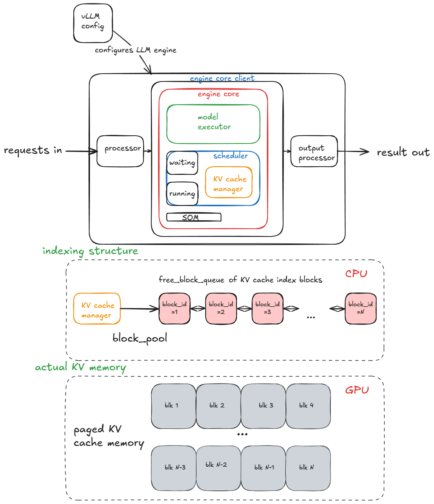

**图 1**：本节描述的核心组件及其关系
</div>

> **注：** 标准 Transformer 层（非 MLA [4]）的块大小计算如下：
> `2× (key/value)× block_size(默认为16)× num_kv_heads × head_size × dtype_num_bytes（例如 bf16 为 2）`

在模型执行器构建期间，会创建一个 `Worker` 对象，并执行三个关键流程。（后续使用 `MultiProcExecutor` 时，这些相同的流程将在不同 GPU 的每个 worker 进程中独立运行。）

- **Init device：**
  - 为 worker 分配 CUDA 设备（例如 "cuda:0"），并检查模型 dtype 是否受支持（例如 bf16）
  - 验证是否有足够的 VRAM，根据请求的 `gpu_memory_utilization`（例如 0.8 → 使用 80% 的 VRAM）
  - 设置分布式配置（DP / TP / PP / EP 等）
  - 实例化 `model_runner`（持有采样器、KV 缓存和前向传递缓冲区，如 `input_ids`、`positions` 等）
  - 实例化 `InputBatch` 对象（持有 CPU 端前向传递缓冲区、KV 缓存索引的 block table、采样元数据等）

- **Load model：**
  - 实例化模型架构
  - 加载模型权重
  - 调用 `model.eval()`（PyTorch 推理模式）
  - 可选：对模型调用 `torch.compile()`

- **Initialize KV cache：**
  - 获取每层 KV 缓存规格。历史上这始终是 `FullAttentionSpec`(homogeneous Transformer)，但随着混合模型（滑动窗口、Transformer/SSM 如 Jamba）的出现，变得更加复杂(参见 Jenga [5](#ref5))
  - 运行一次虚拟/性能分析前向传递，并拍摄 GPU 内存快照，计算可用 VRAM 中能容纳多少 KV 缓存块
  - 分配、重塑 KV 缓存张量并绑定到注意力层
  - 准备注意力元数据（例如设置后端为 FlashAttention），供内核在前向传递期间使用
  - 除非提供了 `--enforce-eager`，否则对每个 warmup batch size 进行虚拟运行并捕获 CUDA Graph。CUDA Graph 将整个 GPU 工作序列记录为 DAG。后续在前向传递期间，我们启动/回放预先构建的图，减少内核启动开销从而提高延迟

我在此抽象掉了许多底层细节——但上述是我现在要介绍的核心部分，因为在后续章节中我会反复引用它们。

现在引擎已经初始化，让我们进入 `generate` 函数。

## Generate 函数

第一步是验证并将请求送入引擎。对于每个 prompt：

- 创建唯一的请求 ID 并记录其到达时间
- 调用输入预处理器对 prompt 进行分词，返回包含 `prompt`、`prompt_token_ids` 和 `type`（text、tokens、embeds 等）的字典
- 将此信息打包为 `EngineCoreRequest`，添加优先级、采样参数和其他元数据
- 将请求传递给引擎核心，引擎核心将其包装为 `Request` 对象并将状态设置为 `WAITING`。然后该请求被添加到调度器的 `waiting` 队列（FCFS 则追加，priority 则堆推送）

此时引擎已被喂入数据，可以开始执行。在同步引擎示例中，这些初始 prompt 是我们唯一要处理的，无法在运行时注入新请求。相比之下，异步引擎支持这样做（即 **Continuous Batching [6](#ref6)**）：每个步骤之后，新旧请求都会被考虑。

> **注：** 由于前向传递将 batch 展平为单个序列，且自定义内核高效处理，因此即使在同步引擎中，连续批处理也是从根本上支持的。

接下来，只要有请求需要处理，引擎就会反复调用其 `step()` 函数。每个步骤有三个阶段：

1. **Schedule**：选择在此步骤中运行的请求(decode 和/或(chunked)prefill)
2. **Forward pass**：运行模型并采样 token
3. **Postprocess**：将采样的 token ID 追加到每个 `Request`，解码并检查停止条件。如果请求完成，清理（例如将其 KV 缓存块归还给 `free_block_queue`）并返回输出

> **注：** 停止条件为：
>
> - 请求超出其长度限制（`max_model_length` 或自身的 `max_tokens`）
> - 采样的 token 是 EOS ID（除非启用了 `ignore_eos`——在基准测试中需要强制生成一定数量的输出 token 时很有用）
> - 采样的 token 匹配采样参数中指定的 `stop_token_ids` 中的任何一个
> - 输出中存在停止字符串——我们截断输出直到第一个停止字符串出现的位置，并在引擎中中止请求（注意 `stop_token_ids` 会保留在输出中，但停止字符串不会）

<div align="center">
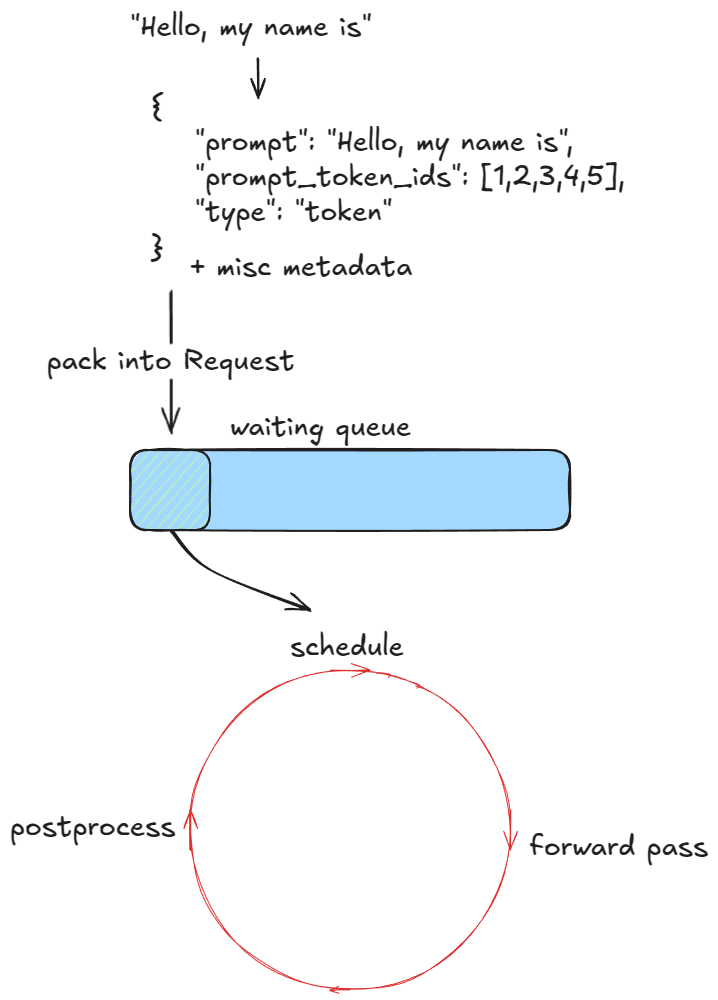

**图 2**：引擎循环(Engine loop)
</div>


> **注：** 在流式模式(streaming mode)下，我们会在生成中间 token 时立即发送它们，但我们现在暂时忽略。

接下来，我们将更详细地分析调度。

### 调度器

推理引擎处理两种主要的工作负载类型：

- **Prefill 请求**——对所有 prompt token 进行前向传递。这些通常是**计算密集型**的（阈值取决于硬件和 prompt 长度）。最后，我们从最终 token 位置的概率分布中采样得到一个 token。
- **Decode 请求**——仅对最近一个 token 进行前向传递。所有之前的 KV 向量已经缓存。这是**内存带宽密集型**的，因为我们仍然需要加载所有 LLM 权重（和 KV 缓存）。

> **注：** 在基准测试(benchmarking)部分，我们将分析所谓的 GPU 性能 Roofline 模型。这将更深入地解释 prefill/decode 的性能特性。

V1 调度器可以在同一步骤中混合两种类型的请求，得益于更智能的设计选择。相比之下，V0 引擎一次只能处理 prefill 或 decode。

调度器优先处理 decode 请求——即已经在 `running` 队列中的请求。对于每个这样的请求：

- 计算要生成的新 token 数量（不总是 1，因为推测解码和异步调度的原因——稍后详述）。
- 调用 KV 缓存管理器的 `allocate_slots` 函数（细节如下）。
- 通过减去步骤 1 中的 token 数量来更新 token 预算。

之后，它处理来自 `waiting` 队列的 prefill 请求：

- 获取已计算的块数量（如果禁用了前缀缓存则返回 0——稍后介绍）。
- 调用 KV 缓存管理器的 `allocate_slots` 函数。
- 将请求从 waiting 弹出并移入 running，状态设置为 `RUNNING`。
- 更新 token 预算。

现在来看 `allocate_slots` 做了什么：

- **计算块数量**——确定必须分配多少个新的 KV 缓存块（`n`）。默认每个块存储 16 个 token。例如，如果 prefill 请求有 17 个新 token，我们需要 `ceil(17/16) = 2` 个块。
- **检查可用性**——如果管理器池中没有足够的块，则提前退出。根据是 decode 还是 prefill 请求，引擎可能会通过驱逐低优先级请求来尝试重新计算抢占（swap 抢占在 V0 中支持），或者跳过调度继续执行。
- **分配块**——通过 KV 缓存管理器的协调器，从块池（之前提到的 `free_block_queue` 双向链表）中获取前 `n` 个块。存储到 `req_to_blocks`，这是一个将每个 `request_id` 映射到其 KV 缓存块列表的字典。

<div align="center">
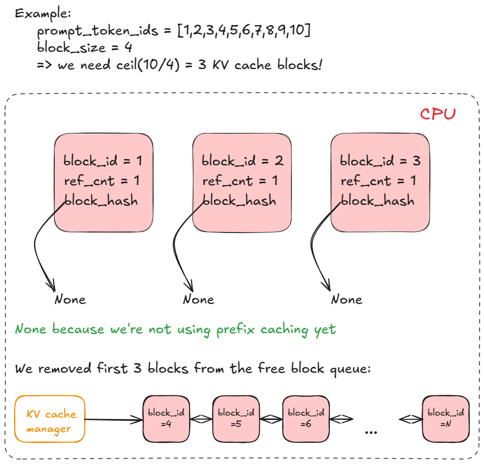

**图 3**：KV 缓存块列表
</div>


我们终于准备好,可以执行前向传递了！

## 运行前向传递

我们调用模型执行器的 `execute_model`，它委托给 `Worker`，进而委托给 model runner。

主要步骤如下：

- **Update states**——从 `input_batch` 中移除已完成的请求；更新与前向传递相关的各种元数据（例如，每个请求的 KV 缓存块，将用于索引分页的 KV 缓存内存）。
- **Prepare inputs**——将缓冲区从 CPU 复制到 GPU；计算位置；构建 `slot_mapping`（稍后示例说明）；构建注意力元数据。
- **Forward pass**——使用自定义 Paged Attention 内核运行模型。所有序列被展平并连接成一个长的"超级序列"。位置索引和注意力掩码确保每个序列只关注自己的 token，这使得无需右填充即可实现连续批处理。
- **Gather last-token states**——提取每个序列最后位置的隐藏状态并计算 logits。
- **Sample**——根据采样配置（贪心、temperature、top-p、top-k 等）从计算出的 logits 中采样 token。

前向传递步骤本身有两种执行模式：

- **Eager 模式**——启用 eager 执行时运行标准 PyTorch 前向传递。
- **"Captured" 模式**——未强制 eager 时，执行/回放预捕获的 CUDA Graph（记得我们在引擎构建时的初始化 KV 缓存流程中捕获了这些）。

下面是一个具体示例，应该能让 Continuous Batching 和 Paged Attention 变得清晰：

<div align="center">
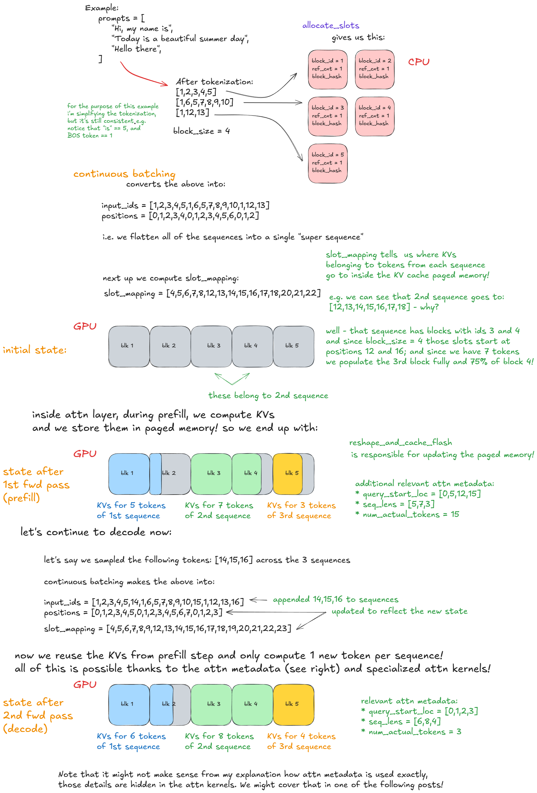

**图 4**：前向传递：Continuous Batching 和 Paged Attention
</div>


# 高级特性——扩展核心引擎逻辑

有了基础引擎流程，我们现在可以看看高级特性。

我们已经讨论了抢占、Paged Attention 和 Continuous Batching。

接下来，我们将深入探讨：

- 分块预填充（Chunked Prefill）
- 前缀缓存（Prefix Caching）
- 引导解码（Guided Decoding，通过语法约束的有限状态机）
- 推测解码（Speculative Decoding）
- 分离式 P/D（Disaggregated P/D）

## 分块预填充（Chunked Prefill）

分块预填充是一种处理长 prompt 的技术，通过将其 prefill 步骤分割为较小的块。没有它，一个单一的长请求可能垄断一个引擎步骤，阻止其他 prefill 请求运行。这会推迟所有其他请求并增加它们的延迟。

例如，让每个块包含 `n`（=8）个 token，用 "-" 分隔的小写字母标记。一个长 prompt `P` 可能看起来像 `x-y-z`，其中 `z` 是一个不完整的块（例如 2 个 token）。那么为 `P` 执行完整的 prefill 将需要 ≥ 3 个引擎步骤（> 可能发生在某个步骤中它没有被调度执行时），只有在最后一个分块 prefill 步骤中，我们才会采样一个新 token。

以下是可视化示例：

<div align="center">
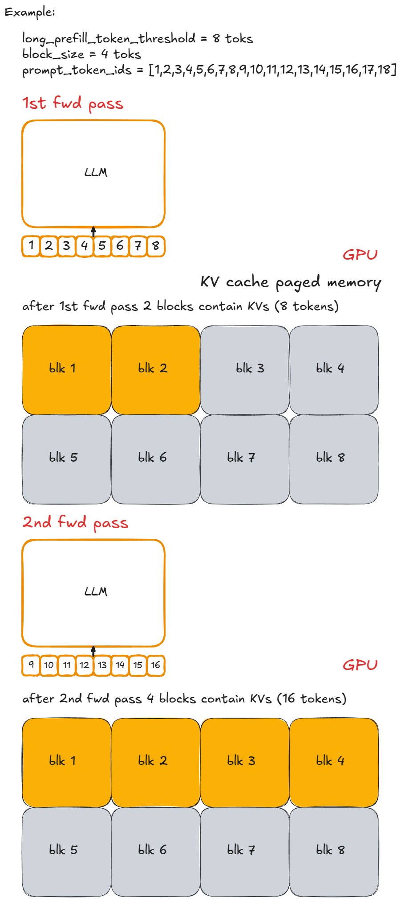

**图 5**：分块预填充(Chunked prefill)
</div>


实现很直接：限制每个步骤的新 token 数量。如果请求的数量超过 `long_prefill_token_threshold`，将其重置为该值。底层的索引逻辑（之前描述的）会处理其余部分。

在 vLLM V1 中，通过将 `long_prefill_token_threshold` 设置为正整数来启用分块预填充。（严格来说，如果不设置，但如果 prompt 长度超过 token 预算，我们也会截断它并运行分块预填充。）

## 前缀缓存(Prefix Caching)

为了解释前缀缓存的工作原理，让我们对原始代码示例稍作修改：

```python
from vllm import LLM, SamplingParams

long_prefix = "<一段被编码为超过 block_size 个 token 的文本>"

prompts = [
    "Hello, my name is",
    "The president of the United States is",
]

sampling_params = SamplingParams(temperature=0.8, top_p=0.95)

def main():
    llm = LLM(model="TinyLlama/TinyLlama-1.1B-Chat-v1.0")

    outputs = llm.generate(long_prefix + prompts[0], sampling_params)
    outputs = llm.generate(long_prefix + prompts[1], sampling_params)

if __name__ == "__main__":
    main()
```

前缀缓存避免了重新计算多个 prompt 在开头共享的 token——因此叫做**前缀**。

关键部分是 `long_prefix`：它被定义为任何长度超过 KV 缓存块（默认 16 个 token）的前缀。为了简化示例，假设 `long_prefix` 的长度恰好为 `n × block_size`（其中 `n ≥ 1`）。

> **注：** 即它完美对齐块边界——否则我们不得不重新计算 `long_prefix_len % block_size` 个 token，因为我们无法缓存不完整的块。

没有前缀缓存时，每次处理一个带有相同 `long_prefix` 的新请求时，我们都要重新计算所有 `n × block_size` 个 token。

有了前缀缓存，这些 token 只计算一次（它们的 KV 存储在 KV 缓存分页内存中），然后被复用，因此只需要处理新的 prompt token。这加速了 prefill 请求（但对 decode 没有帮助）。

这在 vLLM 中是如何工作的？

在第一次 `generate` 调用期间，在调度阶段，`kv_cache_manager.get_computed_blocks` 内部，引擎调用 `hash_request_tokens`：

- 此函数将 `long_prefix + prompts[0]` 分割为 16 个 token 一组的块。
- 对于每个完整块，它计算一个哈希（使用内置哈希或 SHA-256，SHA-256 较慢但碰撞更少）。哈希组合了前一个块的哈希、当前 token 和可选的元数据。

> **注：** 可选元数据包括：MM hash、LoRA ID、cache salt（注入到第一个块的哈希中，确保只有具有此 cache salt 的请求才能复用这些块）。

- 每个结果存储为 `BlockHash` 对象，包含哈希和其 token ID。我们返回一个块哈希列表。

该列表存储在 `self.req_to_block_hashes[request_id]` 中。

接下来，引擎调用 `find_longest_cache_hit` 检查这些哈希中的任何一个是否已存在于 `cached_block_hash_to_block` 中。在第一个请求中，没有命中。

<div align="center">
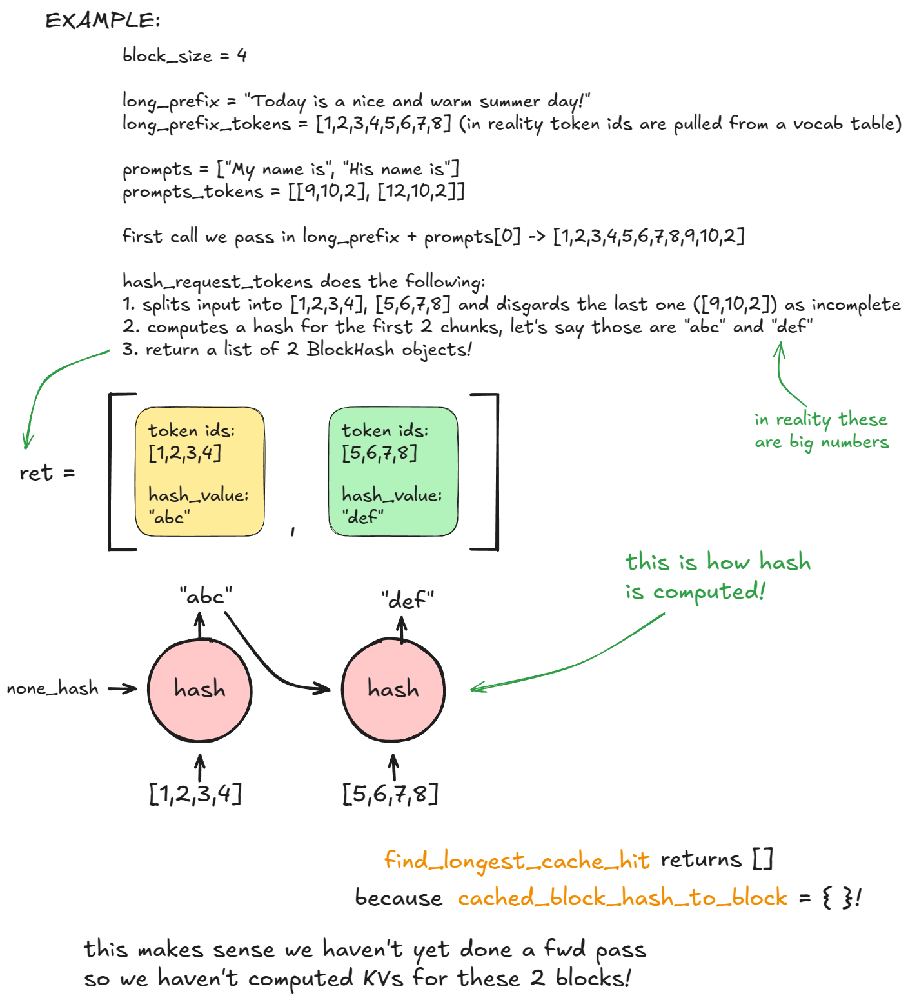

**图 6**：前缀缓存——哈希函数
</div>


然后我们调用 `allocate_slots`，它调用 `coordinator.cache_blocks`，将新的 `BlockHash` 条目与分配的 KV 块关联，并记录在 `cached_block_hash_to_block` 中。

之后，前向传递将在对应的分页 KV 缓存内存中填充 KVs。

> **注：** 经过多个引擎步骤后，会分配更多 KV 缓存块，但这在我们的示例中不影响，因为前缀在 long_prefix 之后立即分叉了。

<div align="center">
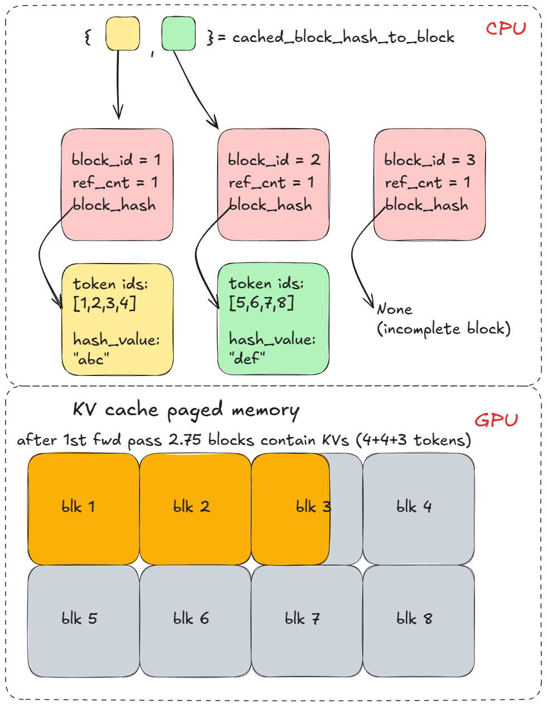

**图 7**：前缀缓存——在分页内存中填充 KVs
</div>


在第二次使用相同前缀的 `generate` 调用中，重复步骤1-3 ，但现在 `find_longest_cache_hit` 为所有 `n` 个块找到了匹配（通过线性搜索）。引擎可以直接复用这些 KV 块。

<div align="center">
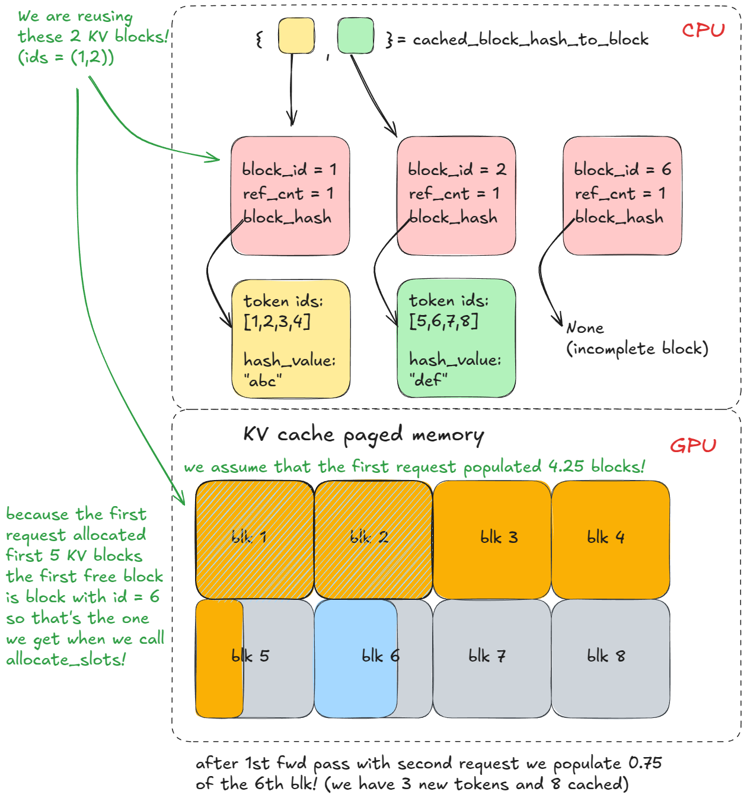

**图 8**：前缀缓存——复用 KVs
</div>


如果原始请求仍然存活，这些块的引用计数将增加（例如增加到 2）。在此示例中，第一个请求已经完成，因此这些块被释放回池中，引用计数重置为 0。因为我们能够从 `cached_block_hash_to_block` 检索到它们，所以知道它们是有效的（KV 缓存管理器的逻辑如此设置），我们只需再次将它们从 `free_block_queue` 中移除。

> **高级注：** KV 缓存块只有在即将从 `free_block_queue` 被重新分配时才变为无效（从左侧弹出），此时我们发现该块仍然有关联的哈希并存在于 `cached_block_hash_to_block` 中。此时，我们清除该块的哈希并从 `cached_block_hash_to_block` 中移除其条目，确保它无法通过前缀缓存被复用（至少不能用于该旧前缀）。

这就是前缀缓存的要点：不要重新计算已经见过的前缀——直接复用它们的 KV 缓存！

如果你理解了这个示例，你也就理解了 Paged Attention 的工作原理。

前缀缓存默认启用。禁用它：`enable_prefix_caching = False`。

## 引导解码（Guided Decoding / FSM）

引导解码是一种技术，在每一步解码中，logits 被基于语法的有限状态机约束。这确保只有语法允许的 token 才能被采样。

这是一个强大的设置：你可以强制执行从正则文法（乔姆斯基类型 3，例如任意正则表达式模式）到上下文无关文法（类型 2，涵盖大多数编程语言）的任何约束。

为了使其不那么抽象，让我们从最简单的例子开始，基于我们之前的代码：

```python
from vllm import LLM, SamplingParams
from vllm.sampling_params import GuidedDecodingParams

prompts = [
    "This sucks",
    "The weather is beautiful",
]

guided_decoding_params = GuidedDecodingParams(choice=["Positive", "Negative"])
sampling_params = SamplingParams(guided_decoding=guided_decoding_params)

def main():
    llm = LLM(model="TinyLlama/TinyLlama-1.1B-Chat-v1.0")

    outputs = llm.generate(prompts, sampling_params)

if __name__ == "__main__":
    main()
```

在我给出的玩具示例中（假设字符级分词）：在 prefill 时，FSM 掩盖 logits 使得只有 "P" 或 "N" 是可行的。如果采样到 "P"，FSM 转移到 "Positive" 分支；下一步只允许 "o"，依此类推。

<div align="center">
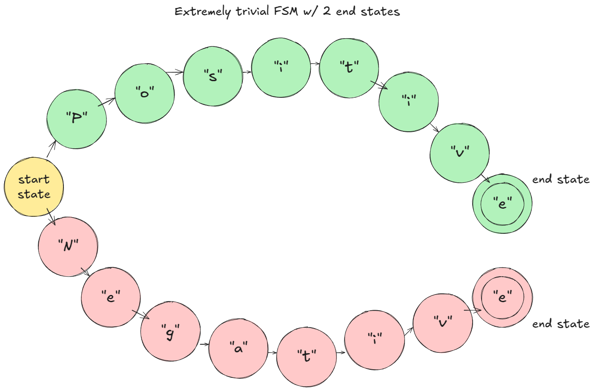

**图 9**：FSM简单示例
</div>

vLLM 中的工作方式：

1. 在 LLM 引擎构建时，创建一个 `StructuredOutputManager`；它可以访问 tokenizer 并维护一个 `_grammar_bitmask` 张量。
2. 当添加请求时，其状态设置为 `WAITING_FOR_FSM`，`grammar_init` 选择后端编译器（例如 `xgrammar` [7]；注意后端是第三方代码）。
3. 该请求的文法被异步编译。
4. 在调度期间，如果异步编译已完成，状态切换为 `WAITING` 并将 `request_id` 添加到 `structured_output_request_ids`；否则放入 `skipped_waiting_requests` 以在下一个引擎步骤重试。
5. 调度循环之后（仍在调度内部），如果有 FSM 请求，`StructuredOutputManager` 请求后端准备/更新 `_grammar_bitmask`。
6. 前向传递产生 logits 后，`xgr_torch_compile` 的函数将 bitmask 扩展到词汇表大小（32 倍扩展比，因为我们使用 32 位整数），并将不允许的 logits 掩盖为 –∞。
7. 采样下一个 token 后，通过 `accept_tokens` 推进请求的 FSM。视觉上我们在 FSM 图上转移到下一个状态。

第 6 步值得进一步说明:

如果 `vocab_size = 32`，`_grammar_bitmask` 是一个单独的整数；其二进制表示编码了哪些 token 被允许（"1"）和不允许（"0"）。例如，"101…001" 扩展到长度为 32 的数组 `[1, 0, 1, ..., 0, 0, 1]`；位置为 0 的 logits 被设置为 –∞。对于更大的词汇表，使用多个 32 位字并相应地扩展/连接。后端（例如 `xgrammar`）负责使用当前 FSM 状态生成这些位模式。

> **注：** 这里的大部分复杂性隐藏在第三方库中，如 xgrammar。

以下是一个更简单的示例，vocab_size = 8，使用 8 位整数（献给喜欢我图示的读者）：

<div align="center">
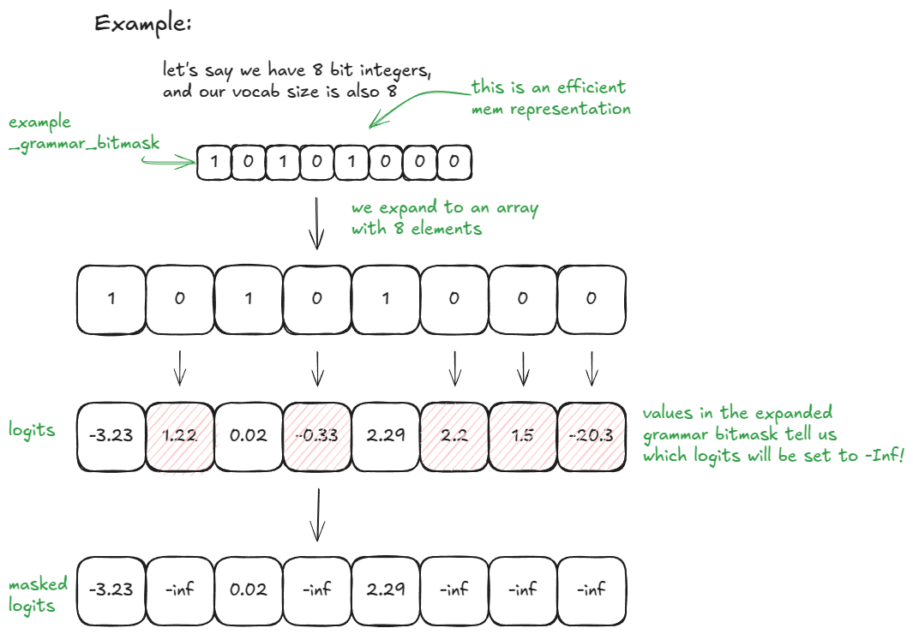

**图 10**：简单示例
</div>

你可以通过传入所需的 `guided_decoding` 配置在 vLLM 中启用此功能。

## 推测解码（Speculative Decoding）

在自回归生成中，每个新 token 都需要大语言模型的一次前向传递。这代价高昂——每个步骤都要重新加载并应用所有模型权重，只为计算一个 token！（假设 batch size == 1，一般情况是 `B`）

推测解码[8](#ref8) 通过引入一个更小的 draft LM 来加速。Draft 模型以低成本提出 `k` 个候选 token。但我们最终不想从小模型采样——它只是用来猜测候选延续的。大模型仍然决定什么是有效的。

步骤如下：

1. **Draft**：在当前上下文中运行小模型，提出 `k` 个 token。
2. **Verify**：在上下文 + `k` 个 draft token 上运行大模型一次。这为这 `k` 个位置加上一个额外位置产生概率（因此我们得到 `k+1` 个候选）。
3. **Accept/reject**：从左到右遍历 `k` 个 draft token：
   - 如果大模型对 draft token 的概率 ≥ draft 模型的概率，接受它
   - 否则，以概率 `p_large(token) / p_draft(token)` 接受它
   - 在第一个拒绝处停止，或接受所有 `k` 个 draft token

**为什么这有效**：虽然我们使用小模型来提出候选，但接受/拒绝规则保证了在期望上，序列的分布与我们从大模型逐 token 采样完全一致。这意味着推测解码在统计上等同于标准自回归解码——但可能快得多，因为一次大模型传递可以产生多达 `k+1` 个 token。

> **注：** 推荐查看 [gpt-fast](https://github.com/pytorch-labs/gpt-fast) 了解简单实现，以及原始论文了解数学细节和与从完整模型采样等价性的证明。

vLLM V1 不支持 LLM draft 模型方法，而是实现了更快但准确度较低的提案方案：n-gram、EAGLE[9](#ref10)和Medusa[10](#ref10)。

各自的简要说明：

- **n-gram**：取最后 `prompt_lookup_max` 个 token；在序列中查找之前的匹配；如果找到，提出匹配之后出现的 `k` 个 token；否则减小窗口并重试，直到 `prompt_lookup_min`。

> **注：** 当前实现在第一个匹配后返回 k 个 token。引入就近偏好并反转搜索方向感觉更自然？（即最后一个匹配）

- **Eagle**：对大 LM 进行"模型手术"——保留嵌入和 LM head，将 Transformer 堆栈替换为轻量级 MLP；将其微调为廉价的 draft 模型。
- **Medusa**：在大模型顶部（LM head 之前的嵌入）训练辅助线性头，以并行预测接下来的 `k` 个 token；使用这些头以比运行独立的小 LM 更高效的方式提出 token。

以下是如何在 vLLM 中使用 `ngram` 作为 draft 方法调用推测解码：

```python
from vllm import LLM, SamplingParams

prompts = [
    "Hello, my name is",
    "The president of the United States is",
]

sampling_params = SamplingParams(temperature=0.8, top_p=0.95)

speculative_config={
    "method": "ngram",
    "prompt_lookup_max": 5,
    "prompt_lookup_min": 3,
    "num_speculative_tokens": 3,
}

def main():
    llm = LLM(model="TinyLlama/TinyLlama-1.1B-Chat-v1.0", speculative_config=speculative_config)

    outputs = llm.generate(prompts, sampling_params)

if __name__ == "__main__":
    main()
```

vLLM 中的工作方式：

**Setup（引擎构建期间）：**

- Init device：创建 `drafter`（draft 模型，例如 `NgramProposer`）和 `rejection_sampler`（部分用 Triton 编写）。
- Load model：加载 draft 模型权重（n-gram 为 no-op）。

**之后在 generate 函数中**（假设我们收到一个全新请求）：

1. 用大模型运行常规 prefill 步骤。
2. 前向传递和标准采样后，调用 `propose_draft_token_ids(k)` 从 draft 模型采样 `k` 个 draft token。
3. 将它们存储在 `request.spec_token_ids` 中（更新请求元数据）。
4. 在下一个引擎步骤，当请求在 running 队列中时，将 `len(request.spec_token_ids)` 添加到"新 token"计数，以便 `allocate_slots` 为前向传递预留足够的 KV 块。
5. 将 `spec_token_ids` 复制到 `input_batch.token_ids_cpu` 中，形成（上下文 + draft）token。
6. 通过 `_calc_spec_decode_metadata` 计算元数据（这复制 `input_batch.token_ids_cpu` 中的 token，准备 logits 等），然后在 draft token 上运行大模型前向传递。
7. 不进行常规的 logits 采样，而是使用 `rejection_sampler` 从左到右接受/拒绝，并产生 `output_token_ids`。
8. 重复步骤 2-7，直到满足停止条件。

最好的内化方式是启动调试器并逐步跟踪代码库，但本节希望给你一个大致的概念。还有这个图示：

<div align="center">
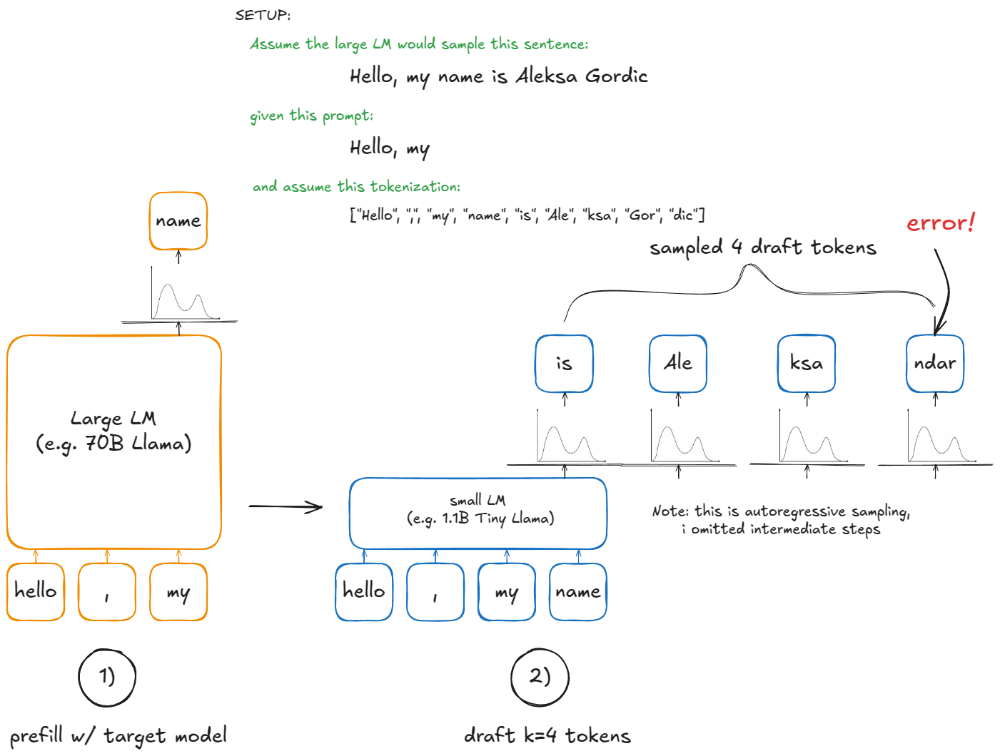
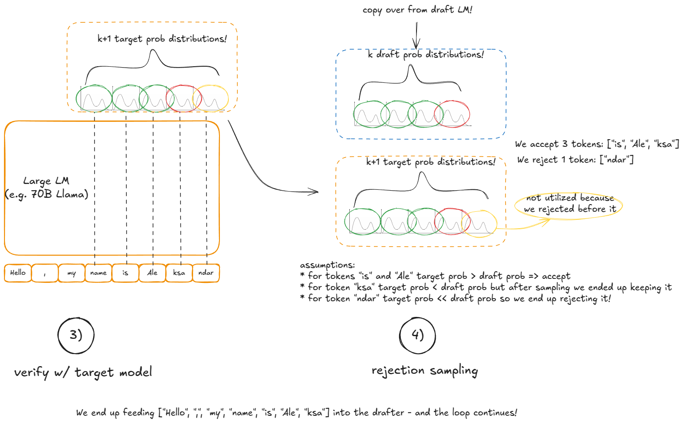

**图 11**：推测解码(Speculative decoding)
</div>


## P/D分离（Disaggregated P/D）

我之前已经提过P/D(prefill/decode)分离的动机。

Prefill 和 Decode 有非常不同的性能特征（计算密集型 vs 内存带宽密集型），因此将它们的执行分离是合理的设计。它能更紧密地控制延迟——`TTFT`（首 token 时间）和 `ITL`（token 间延迟）——更多内容见基准测试部分。

在实践中，我们运行 `N` 个 vLLM prefill 实例和 `M` 个 vLLM decode 实例，根据实时请求混合情况自动扩缩。Prefill worker 将 KV 写入专用的 KV 缓存服务；decode worker 从中读取。这将长而突发的 prefill 与稳定、对延迟敏感的 decode 隔离开来。

vLLM 中的工作方式：

为清晰起见，下面的示例依赖于 `SharedStorageConnector`，这是一个用于说明机制的调试连接器实现。

> **注：** Connector 是 vLLM 用于处理实例间 KV 交换的抽象。Connector 接口尚未稳定，近期有计划进行一些改进，可能会涉及变更，有些可能是不兼容的。

我们启动 2 个 vLLM 实例（GPU 0 用于 prefill，GPU 1 用于 decode），然后在它们之间传输 KV 缓存：

```python
import os
import time
from multiprocessing import Event, Process
import multiprocessing as mp

from vllm import LLM, SamplingParams
from vllm.config import KVTransferConfig

prompts = [
    "Hello, my name is",
    "The president of the United States is",
]

def run_prefill(prefill_done):
  os.environ["CUDA_VISIBLE_DEVICES"] = "0"

  sampling_params = SamplingParams(temperature=0, top_p=0.95, max_tokens=1)

  ktc=KVTransferConfig(
      kv_connector="SharedStorageConnector",
      kv_role="kv_both",
      kv_connector_extra_config={"shared_storage_path": "local_storage"},
  )

  llm = LLM(model="TinyLlama/TinyLlama-1.1B-Chat-v1.0", kv_transfer_config=ktc)
  llm.generate(prompts, sampling_params)

  prefill_done.set()  # 通知 decode 实例 KV 缓存已就绪

  # 保持 prefill 节点运行，以防 decode 节点未完成；
  # 否则脚本可能过早退出，导致解码不完整。
  try:
      while True:
          time.sleep(1)
  except KeyboardInterrupt:
      print("Script stopped by user.")

def run_decode(prefill_done):
  os.environ["CUDA_VISIBLE_DEVICES"] = "1"

  sampling_params = SamplingParams(temperature=0, top_p=0.95)

  ktc=KVTransferConfig(
      kv_connector="SharedStorageConnector",
      kv_role="kv_both",
      kv_connector_extra_config={"shared_storage_path": "local_storage"},
  )

  llm = LLM(model="TinyLlama/TinyLlama-1.1B-Chat-v1.0", kv_transfer_config=ktc)

  prefill_done.wait()  # 阻塞等待来自 prefill 实例的 KV 缓存

  # 内部会先获取 KV 缓存，然后再开始解码循环
  outputs = llm.generate(prompts, sampling_params)

if __name__ == "__main__":
  prefill_done = Event()
  prefill_process = Process(target=run_prefill, args=(prefill_done,))
  decode_process = Process(target=run_decode, args=(prefill_done,))

  prefill_process.start()
  decode_process.start()

  decode_process.join()
  prefill_process.terminate()
```

> **注：** 我也实验了 [LMCache](https://github.com/LMCache/LMCache) [11](#ref11)，这是最快的Production-ready Connector（使用 NVIDIA 的 NIXL 作为后端），但它仍然处于前沿阶段，我遇到了一些 bug。由于它的大部分复杂性存在于外部仓库中，`SharedStorageConnector` 更适合用于解释。

vLLM 中的步骤：

1. **Instantiation**——在引擎构建期间，连接器在两处创建：
   - 在 worker 的 init device 流程内（初始化 worker 分布式环境函数下），角色为 "worker"。
   - 在调度器构造函数内，角色为 "scheduler"。

2. **Cache lookup**——当调度器处理来自 `waiting` 队列的 prefill 请求时（在本地前缀缓存检查之后），调用连接器的 `get_num_new_matched_tokens`。这会检查 KV 缓存服务器中外部缓存的 token。Prefill 在这里总是看到 0；decode 可能有缓存命中。结果在调用 `allocate_slots` 之前添加到本地计数。

3. **State update**——调度器然后调用 `connector.update_state_after_alloc`，记录有缓存的请求（prefill 是 no-op）。

4. **Build metadata object**——在调度结束时，调度器调用 `meta = connector.build_connector_meta`：
   - Prefill 添加所有 `is_store=True` 的请求（上传 KV）。
   - Decode 添加 `is_store=False` 的请求（获取 KV）。

5. **Context manager**——前向传递之前，引擎进入 KV 连接器上下文管理器：
   - 进入时：调用 `kv_connector.start_load_kv`。对于 decode，从外部服务器加载 KV 并注入分页内存。对于 prefill，是 no-op。
   - 退出时：调用 `kv_connector.wait_for_save`。对于 prefill，阻塞直到 KV 上传到外部服务器。对于 decode，是 no-op。

以下是可视化示例：

<div align="center">
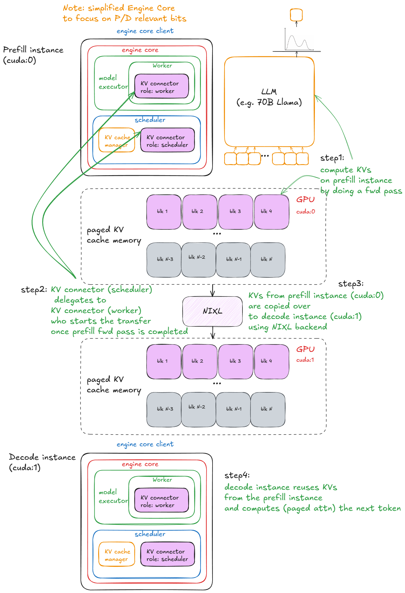

**图 12**：P/D 分离
</div>


> **附加说明：**
>
> - 对于 `SharedStorageConnector`，"外部服务器"只是本地文件系统。
> - 根据配置，KV 传输也可以逐层进行（在每个注意力层之前/之后）。
> - Decode 只在请求的第一步加载外部 KV；之后在本地计算/存储。

## 从 UniprocExecutor 到 MultiProcExecutor

掌握了核心技术之后，我们现在可以讨论横向扩展。

假设你的模型权重不再适合单 GPU 的 VRAM。

第一个选择是使用张量并行（Tensor Parallelism）在同一节点的多个 GPU 上分片模型（例如 `TP=8`）。如果模型仍然放不下，下一步是跨节点的流水线并行（Pipeline Parallelism）。

> **注：**
>
> - 节点内带宽显著高于节点间带宽，这就是为什么张量并行（TP）通常优于流水线并行（PP）。（同样属实的是 PP 通信的数据量比 TP 少。）
> - 我不涉及专家并行（EP），因为我们专注于标准 Transformer 而非 MoE；也不涉及序列并行，因为 TP 和 PP 在实践中使用最广泛。

在这个阶段，我们需要多个 GPU 进程（worker）以及一个编排层来协调它们。这正是 `MultiProcExecutor` 提供的。

<div align="center">
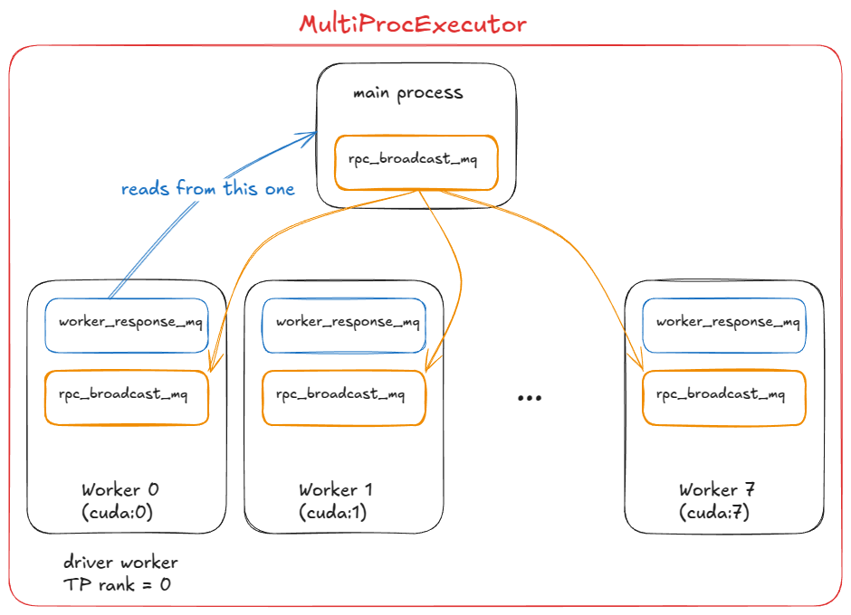

**图 13**：TP=8 设置下的 MultiProcExecutor（driver worker 是 rank 0）
</div>


vLLM 中的工作方式：

- `MultiProcExecutor` 初始化一个 `rpc_broadcast_mq` 消息队列（底层使用共享内存实现）。
- 构造函数遍历 `world_size`（例如 `TP=8 ⇒ world_size=8`），并通过 `WorkerProc.make_worker_process` 为每个 rank 生成一个守护进程。
- 对于每个 worker，父进程首先创建一个 reader 和 writer 管道。
- 新进程运行 `WorkerProc.worker_main`，实例化一个 worker（经历与 `UniprocExecutor` 相同的"init device"、"load model"等流程）。
- 每个 worker 判断自己是 driver（TP 组中的 rank 0）还是普通 worker。每个 worker 设置两个队列：
  - `rpc_broadcast_mq`（与父进程共享）用于接收工作。
  - `worker_response_mq` 用于发送响应。
- 在初始化期间，每个子进程通过管道将 `worker_response_mq` 句柄发送给父进程。一旦全部收到，父进程解除阻塞——这完成了协调。
- Workers 然后进入忙碌循环，阻塞在 `rpc_broadcast_mq.dequeue`。当工作项到达时，它们执行（就像在 `UniprocExecutor` 中一样，但现在有 TP/PP 特定的分区工作）。结果通过 `worker_response_mq.enqueue` 发送回去。
- 在运行时，当请求到达时，`MultiProcExecutor` 将其入队到 `rpc_broadcast_mq`（非阻塞）给所有子 worker。然后等待指定输出 rank 的 `worker_response_mq.dequeue` 来收集最终结果。

从引擎的角度来看，一切都没有改变——所有这些多进程复杂性都通过对模型执行器的 `execute_model` 调用被抽象掉了。

- `UniProcExecutor` 情况：`execute_model` 直接导致在 worker 上调用 `execute_model`
- `MultiProcExecutor` 情况：`execute_model` 间接地通过 `rpc_broadcast_mq` 导致在每个 worker 上调用 `execute_model`

在这一点上，我们可以使用相同的引擎接口在资源允许的范围内运行任意大的模型。

下一步是横向扩展：启用在多个节点上复制模型的数据并行（`DP > 1`），添加轻量级 DP 协调层，跨副本引入负载均衡，并在前方放置一个或多个 API 服务器来处理传入流量。

# 分布式系统服务 vLLM

有很多方法可以设置服务基础设施，但为了具体起见，下面是一个例子：假设我们有两个 H100 节点，想要在它们上面运行四个 vLLM 引擎。

如果模型需要 `TP=4`，我们可以这样配置节点。

<div align="center">
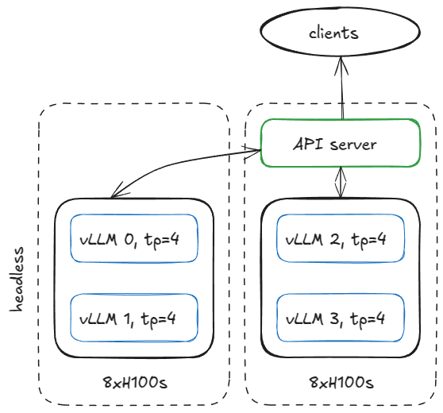

**图 14**：使用 2 个 8xH100 节点的服务器配置（1 个无头节点，1 个 API 服务器节点）
</div>


在第一个节点上，以无头模式（无 API 服务器）运行引擎，使用以下参数：

```bash
vllm serve <model-name>
  --tensor-parallel-size 4
  --data-parallel-size 4
  --data-parallel-size-local 2
  --data-parallel-start-rank 0
  --data-parallel-address <master-ip>
  --data-parallel-rpc-port 13345
  --headless
```

在另一个节点上运行相同的命令，稍作调整：

- 去掉 `--headless`
- 修改 DP start rank

```bash
vllm serve <model-name>
  --tensor-parallel-size 4
  --data-parallel-size 4
  --data-parallel-size-local 2
  --data-parallel-start-rank 2
  --data-parallel-address <master-ip>
  --data-parallel-rpc-port 13345
```

> **注：** 这假设网络配置使得所有节点都能访问指定的 IP 和端口。

vLLM 中的工作方式：

## 在无头服务器节点上

在无头节点上，一个 `CoreEngineProcManager` 启动 2 个进程（根据 `--data-parallel-size-local`），每个运行 `EngineCoreProc.run_engine_core`。这些函数中的每一个创建一个 `DPEngineCoreProc`（引擎核心），然后进入忙碌循环。

`DPEngineCoreProc` 初始化其父类 `EngineCoreProc`（`EngineCore` 的子类），它：

- 创建 `input_queue` 和 `output_queue`（`queue.Queue`）。
- 使用 `DEALER` ZMQ 套接字（异步消息库）与另一个节点上的前端执行初始握手，并接收协调地址信息。
- 初始化 DP 组（例如使用 NCCL 后端）。
- 使用 `MultiProcExecutor` 初始化 `EngineCore`（如之前所述在 4 个 GPU 上 `TP=4`）。
- 创建 `ready_event`（`threading.Event`）。
- 启动输入守护线程（`threading.Thread`）运行 `process_input_sockets(…, ready_event)`。类似地启动输出线程。
- 仍在主线程中，等待 `ready_event`，直到跨 4 个进程（跨 2 个节点）的所有输入线程都完成协调握手，最终执行 `ready_event.set()`。
- 一旦解除阻塞，向前端发送"就绪"消息，附带元数据（例如分页 KV 缓存内存中可用的 `num_gpu_blocks`）。
- 主线程、输入线程和输出线程随后进入各自的忙碌循环。

**TL;DR**：我们最终得到 4 个子进程（每个 DP 副本一个），每个运行主线程、输入线程和输出线程。它们与 DP 协调器和前端完成协调握手，然后每个进程中的三个线程都以稳态忙碌循环运行。

<div align="center">
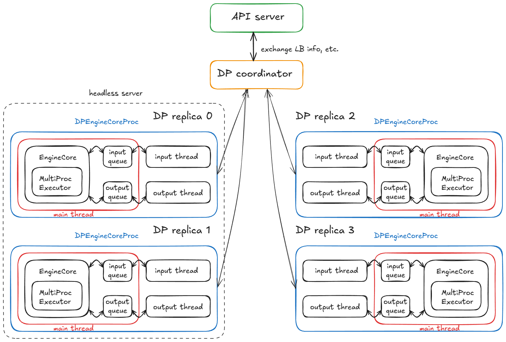

**图 15**：具有 4 个 DP 副本运行 4 个 DPEngineCoreProc 的分布式系统
</div>


**当前稳态**：

- **Input thread**——阻塞在输入套接字上，直到从 API 服务器路由来一个请求；收到后，解码有效载荷，通过 `input_queue.put_nowait(...)` 将工作项入队，然后返回阻塞在套接字上。
- **Main thread**——在 `input_queue.get(...)` 上被唤醒，将请求送入引擎；`MultiProcExecutor` 运行前向传递并将结果入队到 `output_queue`。
- **Output thread**——在 `output_queue.get(...)` 上被唤醒，将结果发送回 API 服务器，然后恢复阻塞。

**附加机制**：

- **DP wave counter**——系统跟踪"waves"；当所有引擎变为空闲时它们静止，当新工作到达时计数器递增（用于协调/指标）。
- **Control messages**——API 服务器可以发送除推理请求之外的其他内容（例如，中止和实用/控制 RPC）。
- **Dummy steps for lockstep**——如果任何 DP 副本有工作，所有副本都执行前向步骤；没有请求的副本执行虚拟步骤以参与所需的同步点（避免阻塞活跃副本）。

> **注：** 锁步澄清：这实际上只对 MoE 模型是必需的，其中专家层形成 EP 或 TP 组，而注意力层仍然是 DP。目前始终与 DP 一起完成——这只是因为"内置"非 MoE DP 的用途有限，因为你可以只运行多个独立的 vLLM 并以正常方式在它们之间进行负载均衡。

现在第二部分，API 服务器节点上发生了什么？

## 在 API 服务器节点上

我们实例化一个 `AsyncLLM` 对象（LLM 引擎的 asyncio 包装器）。内部创建一个 `DPLBAsyncMPClient`（数据并行、负载均衡、异步、多进程客户端）。

在 `MPClient` 的父类中，`launch_core_engines` 函数运行并：

- 创建用于启动握手的 ZMQ 地址（如无头节点上所见）。
- 生成 `DPCoordinator` 进程。
- 创建 `CoreEngineProcManager`（与无头节点上相同）。

在 `AsyncMPClient`（`MPClient` 的子类）中，我们：

- 创建 `outputs_queue`（`asyncio.Queue`）。
- 创建 asyncio 任务 `process_outputs_socket`，它通过输出套接字与所有 4 个 `DPEngineCoreProc` 的输出线程通信，并写入 `outputs_queue`。
- 随后，来自 `AsyncLLM` 的另一个 asyncio 任务 `output_handler` 从此队列读取并最终将信息发送到 `create_completion` 函数。

在 `DPAsyncMPClient` 中，我们创建一个 asyncio 任务 `run_engine_stats_update_task`，它与 DP 协调器通信。

DP 协调器在前端（API 服务器）和后端（引擎核心）之间进行中介。它：

- 定期向前端的 `run_engine_stats_update_task` 发送负载均衡信息（队列大小、等待/运行请求）。
- 从前端处理 `SCALE_ELASTIC_EP` 命令，通过动态更改引擎数量（仅适用于 Ray 后端）。
- 向前端触发时向后端发送 `START_DP_WAVE` 事件，并向后端报告波状态更新。

回顾一下，前端（`AsyncLLM`）运行多个 asyncio 任务（记住：并发，非并行）：

- 一类任务通过 `generate` 路径处理输入请求（每个新的客户端请求生成一个新的 asyncio 任务）。
- 两个任务（`process_outputs_socket`、`output_handler`）处理来自底层引擎的输出消息。
- 一个任务（`run_engine_stats_update_task`）维护与 DP 协调器的通信：发送波触发、轮询负载均衡状态和处理动态扩缩请求。

最后，主服务器进程创建 FastAPI 应用程序并挂载端点，如 `OpenAIServingCompletion` 和 `OpenAIServingChat`，它们暴露 `/completion`、`/chat/completion` 等端点。然后通过 Uvicorn 提供整个服务栈。

综上所述，以下是完整的请求生命周期！

你从终端发送：

```bash
curl -X POST http://localhost:8000/v1/completions -H "Content-Type: application/json" -d '{
  "model": "TinyLlama/TinyLlama-1.1B-Chat-v1.0",
  "prompt": "The capital of France is",
  "max_tokens": 50,
  "temperature": 0.7
}'
```

接下来发生什么：

1. 请求命中 API 服务器上 `OpenAIServingCompletion` 的 `create_completion` 路由。
2. 该函数异步分词 prompt，准备元数据（请求 ID、采样参数、时间戳等）。
3. 然后调用 `AsyncLLM.generate`，这遵循与同步引擎相同的流程，最终调用 `DPAsyncMPClient.add_request_async`。
4. 这反过来调用 `get_core_engine_for_request`，它基于 DP 协调器的状态在引擎之间进行负载均衡（选择分数最低/负载最轻的：`score = len(waiting) * 4 + len(running)`）。
5. `ADD` 请求被发送到所选引擎的 `input_socket`。
6. 在该引擎上：
   - Input thread——解除阻塞，从输入套接字解码数据，将工作项放入主线程的 `input_queue`。
   - Main thread——在 `input_queue` 上解除阻塞，将请求添加到引擎，反复调用 `engine_core.step()`，将中间结果入队到 `output_queue`，直到满足停止条件。

   > **注：提醒：** `step()` 调用调度器、模型执行器（进而可以是 `MultiProcExecutor`！）等。我们已经见过了！

   - Output thread——在 `output_queue` 上解除阻塞，通过输出套接字发送结果。

7. 这些结果触发 `AsyncLLM` 的输出 asyncio 任务（`process_outputs_socket` 和 `output_handler`），它们将 token 传播回 FastAPI 的 `create_completion` 路由。
8. FastAPI 附加元数据（完成原因、logprobs、使用信息等），并通过 Uvicorn 将 `JSONResponse` 返回到你的终端！

就这样，你的 completion 返回了——整个分布式机制隐藏在一个简单的 `curl` 命令之后！:) 太有趣了！！！

> **附加说明：**
>
> - 当添加更多 API 服务器时，负载均衡在 OS/套接字层面处理。从应用程序的角度来看，没有显著变化——复杂性被隐藏了。
> - 使用 Ray 作为 DP 后端，你可以暴露一个 URL 端点（`/scale_elastic_ep`），实现引擎副本数量的自动扩缩。

# 基准测试和自动调优——延迟 vs 吞吐量

到目前为止，我们一直在分析"气体粒子"——请求如何流经引擎/系统的内部机制。现在是时候缩小视野，将系统作为整体来看，并问：我们如何衡量推理系统的性能？

在最高层面有两个相互竞争的指标：

- **延迟（Latency）**——从请求提交到 token 返回的时间
- **吞吐量（Throughput）**——系统每秒可以生成/处理的 token/请求数量

**延迟**对交互式应用最为重要，用户正在等待响应。

**吞吐量**在离线工作负载中很重要，如用于预训练/后训练的合成数据生成、数据清洗/处理，以及一般任何类型的离线批量推理任务。

在解释延迟和吞吐量为何相互竞争之前，让我们定义几个常见的推理指标：

| 指标 | 定义 |
|------|------|
| **TTFT**（Time to First Token，首 token 时间） | 从请求提交到收到第一个输出 token 的时间 |
| **ITL**（Inter-Token Latency，token 间延迟） | 两个连续 token 之间的时间（例如从 token i-1 到 token i） |
| **TPOT**（Time Per Output Token，每输出 token 时间） | 请求中所有输出 token 的平均 ITL |
| **Latency / E2E**（端到端延迟） | 处理请求的总时间，即 TTFT + 所有 ITL 之和，或等价于提交请求与收到最后一个输出 token 之间的时间 |
| **Throughput**（吞吐量） | 每秒处理的总 token 数（输入、输出或两者），或每秒请求数 |
| **Goodput**（有效吞吐量） | 满足服务水平目标（SLO）的吞吐量，例如最大 TTFT、TPOT 或端到端延迟。例如，只有满足这些 SLO 的请求中的 token 才被计入 |

<div align="center">
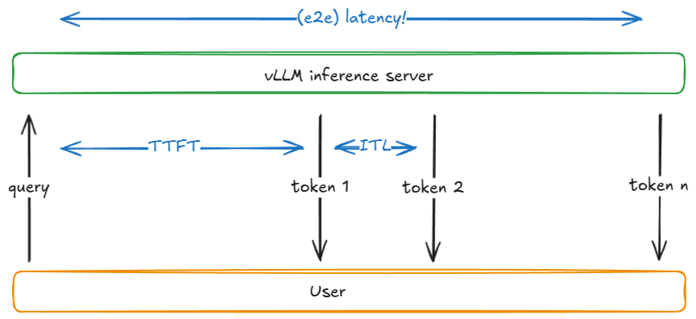

**图 16**：TTFT、ITL、端到端延迟
</div>

以下是一个简化模型，解释这两个指标相互竞争的本质。

> **假设：** 权重 I/O 而非 KV 缓存 I/O 占主导；即我们处理的是短序列。

当观察 batch size `B` 如何影响单个 decode 步骤时，权衡变得清晰。当 `B ↓` 趋向 1，ITL 下降：每步工作量更少，token 没有与其他 token"竞争"。当 `B ↑` 趋向无穷，ITL 上升，因为每步 FLOP 更多——但吞吐量提高（直到达到峰值性能），因为权重 I/O 被更多 token 分摊。

Roofline 模型在这里有帮助：在饱和 batch `B_sat` 以下，步长时间由 HBM 带宽主导（逐层将权重流式传输到片上内存），因此步长延迟几乎持平——计算 1 个 vs 10 个 token 可能花费相似的时间。超过 `B_sat`，内核变为计算密集型，步长时间大致随 `B` 增长；每个额外的 token 都会增加 ITL。

<div align="center">
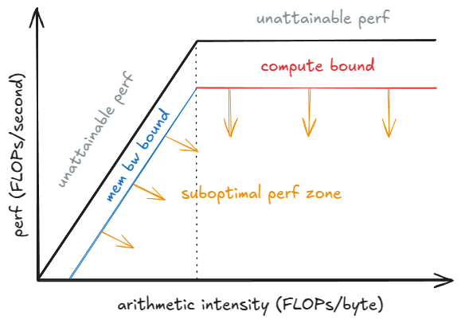

**图 17**：Roofline 性能模型
</div>


> **注：** 对于更严谨的处理，我们必须考虑内核自动调优：随着 B 增长，运行时可能切换到更适合该形状的更高效内核，改变达到的性能 P_kernel。步长延迟为 `t = FLOPs_step / P_kernel`，其中 FLOPs_step 是步骤中的工作量。可以看到当 P_kernel 达到 P_peak 时，每步更多计算将直接导致延迟增加。

## 如何在 vLLM 中进行基准测试

vLLM 提供了 `vllm bench {serve,latency,throughput}` CLI，封装了 `vllm/benchmarks/{server,latency,throughput}.py`。

以下是这些脚本的功能：

- **latency**——使用短输入（默认 32 个 token）并以小 batch（默认 8）采样 128 个输出 token。运行多次迭代并报告 batch 的端到端延迟。
- **throughput**——一次性提交一组固定的 prompt（默认：1000 个 ShareGPT 样本），报告整个运行过程中的输入/输出/总 token 和每秒请求数。
- **serve**——启动 vLLM 服务器，通过从泊松（或更一般的 Gamma）分布中采样请求到达间隔时间来模拟真实世界的工作负载。在时间窗口内发送请求，测量我们讨论过的所有指标，并可以有选择地强制执行服务端最大并发数（通过信号量，例如限制服务器为 64 个并发请求）。

以下是如何运行 latency 脚本的示例：

```bash
vllm bench latency
  --model <model-name>
  --input-tokens 32
  --output-tokens 128
  --batch-size 8
```

> **注：** CI 中使用的基准测试配置位于 `.buildkite/nightly-benchmarks/tests`。

还有一个 auto-tune 脚本，它驱动 serve 基准测试，寻找满足目标 SLO 的参数设置（例如，"在保持 p99 端到端延迟 < 500 ms 的同时最大化吞吐量"），返回建议的配置。

## 后记

我们从基础引擎核心（`UniprocExecutor`）开始，添加了推测解码和前缀缓存等高级特性，扩展到 `MultiProcExecutor`（`TP/PP > 1`），最后横向扩展，将所有内容包装在异步引擎和分布式服务栈中——以如何测量系统性能作结。

vLLM 还包含我略过的专门处理，例如：

- **多样化的硬件后端**：TPU、AWS Neuron（Trainium/Inferentia）等。
- **架构/技术**：`MLA`、`MoE`、encoder-decoder（例如 Whisper）、池化/嵌入模型、`EPLB`、`m-RoPE`、`LoRA`、`ALiBi`、无注意力变体、滑动窗口注意力、多模态 LM，以及状态空间模型（例如 Mamba/Mamba-2、Jamba）
- **TP/PP/SP**
- **混合 KV 缓存逻辑**（Jenga），更复杂的采样方法如 beam sampling 等
- **实验性功能**：异步调度

好在这些大部分与上述主流正交——你几乎可以将它们视为"插件"（当然在实践中存在一定的耦合）。

我热爱理解系统。话虽如此，在当前高度下，分析的精细度肯定有所妥协。在后续文章中，我将深入特定的子系统，进入细节的钻研。

> **联系我：** 如果你在文章中发现任何错误，请私信我——欢迎通过 [X](https://x.com/) 或 [LinkedIn](https://linkedin.com/) 或匿名反馈联系我。

## 致谢

非常感谢 [Hyperstack](https://www.hyperstack.cloud/) 在过去一年中为我的实验提供 H100 GPU！

感谢 [Nick Hill](https://www.linkedin.com/in/nickhillprofile/)（vLLM 核心贡献者，RedHat）、[Kaichao You](https://github.com/youkaichao)（vLLM 核心贡献者）、[Mark Saroufim](https://x.com/marksaroufim)（PyTorch）、[Kyle Krannen](https://www.linkedin.com/in/kyle-kranen/)（NVIDIA，Dynamo）和 [Ashish Vaswani](https://www.linkedin.com/in/ashish-vaswani-99892181/) 阅读了本文的预发布版本并提供反馈！

# 参考文献

<a id="ref1"></a>

[1] vLLM — https://github.com/vllm-project/vllm

<a id="ref2"></a>

[2] Attention Is All You Need — https://arxiv.org/abs/1706.03762

<a id="ref3"></a>

[3] Efficient Memory Management for Large Language Model Serving with PagedAttention — https://arxiv.org/abs/2309.06180

<a id="ref4"></a>

[4] DeepSeek-V2: A Strong, Economical, and Efficient Mixture-of-Experts Language Model — https://arxiv.org/abs/2405.04434

<a id="ref5"></a>

[5] Jenga: Effective Memory Management for Serving LLM with Heterogeneity — https://arxiv.org/abs/2503.18292

<a id="ref6"></a>

[6] Orca: A Distributed Serving System for Transformer-Based Generative Models — https://www.usenix.org/conference/osdi22/presentation/yu

<a id="ref7"></a>

[7] XGrammar: Flexible and Efficient Structured Generation Engine for Large Language Models — https://arxiv.org/abs/2411.15100

<a id="ref8"></a>

[8] Accelerating Large Language Model Decoding with Speculative Sampling — https://arxiv.org/abs/2302.01318

<a id="ref9"></a>

[9] EAGLE: Speculative Sampling Requires Rethinking Feature Uncertainty — https://arxiv.org/abs/2401.15077

<a id="ref10"></a>

[10] Medusa: Simple LLM Inference Acceleration Framework with Multiple Decoding Heads — https://arxiv.org/abs/2401.10774

<a id="ref11"></a>

[11] LMCache — https://github.com/LMCache/LMCache