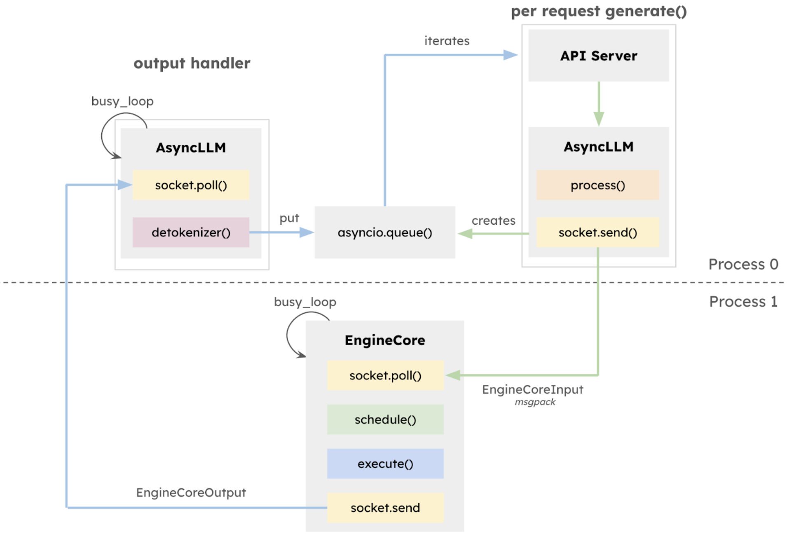

# vLLM 单卡执行流源码解析
文章目前讨论单卡上 vLLM 执行步骤。vLLM 给出了两种请求调度执行方式。执行方式的选择是通过auto dected方式选择的，项目没有暴露选择的接口，大部分时候是选择异步调度。


- 1.串行执行：请求到了打成Batch，将Batch送到GPU上去计算，同时CPU等待计算结果。计算结果返回后，检查是否有请求执行结束，若有将新请求加入，在按着之前的步骤依次执行。
- 2.异步执行：同上Batch A送到GPU之后，CPU不等结果，而是将新到的请求放在Batch B中。A计算完之后，再计算B。

<div align="center">

</div>

vLLM有两种运行方式一种是offline，一种是online。


forward (/home/whh/vllm-project/vllm/vllm/model_executor/models/llama.py:228)
_call_impl (/home/whh/anaconda3/envs/vllm312/lib/python3.12/site-packages/torch/nn/modules/module.py:1790)
_wrapped_call_impl (/home/whh/anaconda3/envs/vllm312/lib/python3.12/site-packages/torch/nn/modules/module.py:1779)
forward (/home/whh/vllm-project/vllm/vllm/model_executor/models/llama.py:328)
_call_impl (/home/whh/anaconda3/envs/vllm312/lib/python3.12/site-packages/torch/nn/modules/module.py:1790)
_wrapped_call_impl (/home/whh/anaconda3/envs/vllm312/lib/python3.12/site-packages/torch/nn/modules/module.py:1779)
forward (/home/whh/vllm-project/vllm/vllm/model_executor/models/llama.py:418)
__call__ (/home/whh/vllm-project/vllm/vllm/compilation/decorators.py:507)
forward (/home/whh/vllm-project/vllm/vllm/model_executor/models/llama.py:572)
_call_impl (/home/whh/anaconda3/envs/vllm312/lib/python3.12/site-packages/torch/nn/modules/module.py:1790)
_wrapped_call_impl (/home/whh/anaconda3/envs/vllm312/lib/python3.12/site-packages/torch/nn/modules/module.py:1779)
_model_forward (/home/whh/vllm-project/vllm/vllm/v1/worker/gpu_model_runner.py:3700)
execute_model (/home/whh/vllm-project/vllm/vllm/v1/worker/gpu_model_runner.py:4239)
decorate_context (/home/whh/anaconda3/envs/vllm312/lib/python3.12/site-packages/torch/utils/_contextlib.py:124)
execute_model (/home/whh/vllm-project/vllm/vllm/v1/worker/gpu_worker.py:844)
decorate_context (/home/whh/anaconda3/envs/vllm312/lib/python3.12/site-packages/torch/utils/_contextlib.py:124)
execute_model (/home/whh/vllm-project/vllm/vllm/v1/worker/worker_base.py:345)
run_method (/home/whh/vllm-project/vllm/vllm/v1/serial_utils.py:510)
collective_rpc (/home/whh/vllm-project/vllm/vllm/v1/executor/uniproc_executor.py:101)
execute_model (/home/whh/vllm-project/vllm/vllm/v1/executor/uniproc_executor.py:114)
step_with_batch_queue (/home/whh/vllm-project/vllm/vllm/v1/engine/core.py:510)
_process_engine_step (/home/whh/vllm-project/vllm/vllm/v1/engine/core.py:1259)
run_busy_loop (/home/whh/vllm-project/vllm/vllm/v1/engine/core.py:1220)
run_engine_core (/home/whh/vllm-project/vllm/vllm/v1/engine/core.py:1179)
run (/home/whh/anaconda3/envs/vllm312/lib/python3.12/multiprocessing/process.py:108)
_bootstrap (/home/whh/anaconda3/envs/vllm312/lib/python3.12/multiprocessing/process.py:314)
_launch (/home/whh/anaconda3/envs/vllm312/lib/python3.12/multiprocessing/popen_fork.py:71)
__init__ (/home/whh/anaconda3/envs/vllm312/lib/python3.12/multiprocessing/popen_fork.py:19)
_Popen (/home/whh/anaconda3/envs/vllm312/lib/python3.12/multiprocessing/context.py:282)
start (/home/whh/anaconda3/envs/vllm312/lib/python3.12/multiprocessing/process.py:121)
__init__ (/home/whh/vllm-project/vllm/vllm/v1/engine/utils.py:194)
launch_core_engines (/home/whh/vllm-project/vllm/vllm/v1/engine/utils.py:1137)
__enter__ (/home/whh/anaconda3/envs/vllm312/lib/python3.12/contextlib.py:137)
__init__ (/home/whh/vllm-project/vllm/vllm/v1/engine/core_client.py:567)
__init__ (/home/whh/vllm-project/vllm/vllm/v1/engine/core_client.py:755)
sync_wrapper (/home/whh/vllm-project/vllm/vllm/tracing/otel.py:178)
make_client (/home/whh/vllm-project/vllm/vllm/v1/engine/core_client.py:102)
__init__ (/home/whh/vllm-project/vllm/vllm/v1/engine/llm_engine.py:104)
from_engine_args (/home/whh/vllm-project/vllm/vllm/v1/engine/llm_engine.py:170)
__init__ (/home/whh/vllm-project/vllm/vllm/entrypoints/llm.py:349)
main (/home/whh/vllm-project/vllm/workspace/example.py:13)
<module> (/home/whh/vllm-project/vllm/workspace/example.py:41)
_run_code (/home/whh/anaconda3/envs/vllm312/lib/python3.12/runpy.py:88)
_run_module_as_main (/home/whh/anaconda3/envs/vllm312/lib/python3.12/runpy.py:198)


# generate()函数
函数调用栈如下：
```
LLM.generate()  # llm.py:476
└─ _run_completion()  # offline_utils.py:341
   ├─ _add_completion_requests()  # offline_utils.py:308
   |  └─ _render_and_add_requests()  # offline_utils.py:536
   |     └─ _add_request()  # offline_utils.py:566
   |        └─ LLMEngine.add_request()  # llm_engine.py:268
   |           ├─ InputProcessor.process_inputs() #InputProcessor.py:244 请求转为EngineCoreRequest
   |           │    
   |           ├─ OutputProcessor.add_request()   #OutputProcessor.py:512 请求添加到llmengine中
   |           │
   |           └─ EngineCore.add_request()        #通过IPC把EngineCoreRequest送到
   |
   └─ _run_engine()                     # entrypoints/offline_utils.py:573
     │
     └─ LLMEngine.step()                      # v1/engine/llm_engine.py:287
          │
          ├─ engine_core.get_output()
          │   
          ├─ output_processor.process_outputs()
          │
          ├─ output_processor.update_scheduler_stats()
          │         
          ├─ engine_core.abort_requests()
```


# EngineCore()
schedule (/home/whh/vllm-project/vllm/vllm/v1/core/sched/scheduler.py:346)
step_with_batch_queue (/home/whh/vllm-project/vllm/vllm/v1/engine/core.py:508)
_process_engine_step (/home/whh/vllm-project/vllm/vllm/v1/engine/core.py:1259)
run_busy_loop (/home/whh/vllm-project/vllm/vllm/v1/engine/core.py:1220)
run_engine_core (/home/whh/vllm-project/vllm/vllm/v1/engine/core.py:1179)


    def run_busy_loop(self):
        """Core busy loop of the EngineCore."""
        while self._handle_shutdown():
            # 1) Poll the input queue until there is work to do.
            self._process_input_queue()
            # 2) Step the engine core and return the outputs.
            self._process_engine_step()

    def _process_engine_step(self) -> bool:
        """Called only when there are unfinished local requests."""

        # Step the engine core.
        outputs, model_executed = self.step_fn()
        # Put EngineCoreOutputs into the output queue.
        for output in outputs.items() if outputs else ():
            self.output_queue.put_nowait(output)
        # Post-step hook.
        self.post_step(model_executed)

        # If no model execution happened but there is still scheduler work
        # (e.g. WAITING_FOR_REMOTE_KVS or delayed KV connector frees), yield
        # the GIL briefly to allow background transfer threads to make progress.
        if not model_executed and self.scheduler.has_requests():
            time.sleep(0.001)

该部分内容从EngineCore的add_request()函数开始：
- 1. InputProcessor.process_inputs()， 将未处理的请求转化为EngineCoreRequest。
- 2. OutputProcessor.add_request()，将请求加到OutputProcessor里面，用于状态检测

大致分为三个队列：
- 1. waiting 新到的请求放到该队列
- 2. running 
- 3. batch_queue 存放打包好batch的队列


## schedule()

- 1. 遍历running中的请求，分配执行的token数量，以及KV缓存。
- 2. 遍历waiting中的请求
- 3. 


## execute 
execute_model (/home/whh/vllm-project/vllm/vllm/v1/worker/gpu_model_runner.py:3968)
execute_model (/home/whh/vllm-project/vllm/vllm/v1/worker/gpu_worker.py:844)
execute_model (/home/whh/vllm-project/vllm/vllm/v1/worker/worker_base.py:345)
run_method (/home/whh/vllm-project/vllm/vllm/v1/serial_utils.py:510)
collective_rpc (/home/whh/vllm-project/vllm/vllm/v1/executor/uniproc_executor.py:101)
execute_model (/home/whh/vllm-project/vllm/vllm/v1/executor/uniproc_executor.py:114)
step_with_batch_queue (/home/whh/vllm-project/vllm/vllm/v1/engine/core.py:510)
_process_engine_step (/home/whh/vllm-project/vllm/vllm/v1/engine/core.py:1259)
run_busy_loop (/home/whh/vllm-project/vllm/vllm/v1/engine/core.py:1220)
run_engine_core (/home/whh/vllm-project/vllm/vllm/v1/engine/core.py:1179)
__init__ (/home/whh/vllm-project/vllm/vllm/v1/engine/utils.py:194)
launch_core_engines (/home/whh/vllm-project/vllm/vllm/v1/engine/utils.py:1137)
__init__ (/home/whh/vllm-project/vllm/vllm/v1/engine/core_client.py:567)
__init__ (/home/whh/vllm-project/vllm/vllm/v1/engine/core_client.py:755)
sync_wrapper (/home/whh/vllm-project/vllm/vllm/tracing/otel.py:178)
make_client (/home/whh/vllm-project/vllm/vllm/v1/engine/core_client.py:102)
__init__ (/home/whh/vllm-project/vllm/vllm/v1/engine/llm_engine.py:104)
from_engine_args (/home/whh/vllm-project/vllm/vllm/v1/engine/llm_engine.py:170)
__init__ (/home/whh/vllm-project/vllm/vllm/entrypoints/llm.py:349)
main (/home/whh/vllm-project/vllm/workspace/example.py:13)

# batch 位置
def _update_states(self, scheduler_output: "SchedulerOutput") -> Callable | None:


# 其他
## batch_queue长度如何决定
如上所示，vLLM分为串行执行和异步执行，执行方式也会影响队列的长度。队列的长度基本由PP的长度决定。见'abstract.py'中父类Executor中的max_concurrent_batches函数。
vLLM根据不同情况，写了三个子类：

- 1. 子类:uniproc_executor.py
     
     ```
     #针对单进程，单卡： vllm/v1/executor/uniproc_executor.py:81

forward (/home/whh/vllm-project/vllm/vllm/model_executor/models/llama.py:228)
_call_impl (/home/whh/anaconda3/envs/vllm312/lib/python3.12/site-packages/torch/nn/modules/module.py:1790)
_wrapped_call_impl (/home/whh/anaconda3/envs/vllm312/lib/python3.12/site-packages/torch/nn/modules/module.py:1779)
forward (/home/whh/vllm-project/vllm/vllm/model_executor/models/llama.py:328)
_call_impl (/home/whh/anaconda3/envs/vllm312/lib/python3.12/site-packages/torch/nn/modules/module.py:1790)
_wrapped_call_impl (/home/whh/anaconda3/envs/vllm312/lib/python3.12/site-packages/torch/nn/modules/module.py:1779)
forward (/home/whh/vllm-project/vllm/vllm/model_executor/models/llama.py:418)
__call__ (/home/whh/vllm-project/vllm/vllm/compilation/decorators.py:507)
forward (/home/whh/vllm-project/vllm/vllm/model_executor/models/llama.py:572)
_call_impl (/home/whh/anaconda3/envs/vllm312/lib/python3.12/site-packages/torch/nn/modules/module.py:1790)
_wrapped_call_impl (/home/whh/anaconda3/envs/vllm312/lib/python3.12/site-packages/torch/nn/modules/module.py:1779)
_model_forward (/home/whh/vllm-project/vllm/vllm/v1/worker/gpu_model_runner.py:3700)
execute_model (/home/whh/vllm-project/vllm/vllm/v1/worker/gpu_model_runner.py:4239)
decorate_context (/home/whh/anaconda3/envs/vllm312/lib/python3.12/site-packages/torch/utils/_contextlib.py:124)
execute_model (/home/whh/vllm-project/vllm/vllm/v1/worker/gpu_worker.py:844)
decorate_context (/home/whh/anaconda3/envs/vllm312/lib/python3.12/site-packages/torch/utils/_contextlib.py:124)
execute_model (/home/whh/vllm-project/vllm/vllm/v1/worker/worker_base.py:345)
run_method (/home/whh/vllm-project/vllm/vllm/v1/serial_utils.py:510)
collective_rpc (/home/whh/vllm-project/vllm/vllm/v1/executor/uniproc_executor.py:101)
execute_model (/home/whh/vllm-project/vllm/vllm/v1/executor/uniproc_executor.py:114)
step_with_batch_queue (/home/whh/vllm-project/vllm/vllm/v1/engine/core.py:510)
_process_engine_step (/home/whh/vllm-project/vllm/vllm/v1/engine/core.py:1259)
run_busy_loop (/home/whh/vllm-project/vllm/vllm/v1/engine/core.py:1220)
run_engine_core (/home/whh/vllm-project/vllm/vllm/v1/engine/core.py:1179)
run (/home/whh/anaconda3/envs/vllm312/lib/python3.12/multiprocessing/process.py:108)
_bo
     def max_concurrent_batches(self) -> int:
        return 2 if self.scheduler_config.async_scheduling else 1

     ```
- 2. 子类:multiproc_executor
     ```
     #针对多进程，多卡，TP>1, PP>1： vllm/v1/executor/multiproc_executor.py:476
     def max_concurrent_batches(self) -> int:
          # PP requires PP-size concurrent batches to fill the pipeline.
          pp_size = self.parallel_config.pipeline_parallel_size
          return 2 if pp_size <= 1 and self.scheduler_config.async_scheduling else pp_size
     ```
- 3. 子类:ray_executor
     ```
     #针对多卡多节点：vllm/v1/executor/ray_executor.py
     def max_concurrent_batches(self) -> int:
        """Ray distributed executor supports pipeline parallelism,
        meaning that it allows PP size batches to be executed concurrently.
        """
        pp_size = self.parallel_config.pipeline_parallel_size
        return 2 if pp_size <= 1 and self.scheduler_config.async_scheduling else pp_size
     ```

- `TP` 的思路是把同一层的计算拆到多张卡上，算完后再把结果合起来
- `PP` 的思路是把不同层放到不同设备上，让多个请求像流水线一样依次经过这些层
- `DP` 的思路是直接复制出多个完整模型副本，让不同请求去不同副本上执行
- `EP` 的思路是把不同专家放到不同设备上，让每张卡只负责部分专家，而不是容纳整套专家参数

# 
- enginecore 主要结论是：
- enginecorerequest
- worker

 pipedream

 v1_server_architecture.png