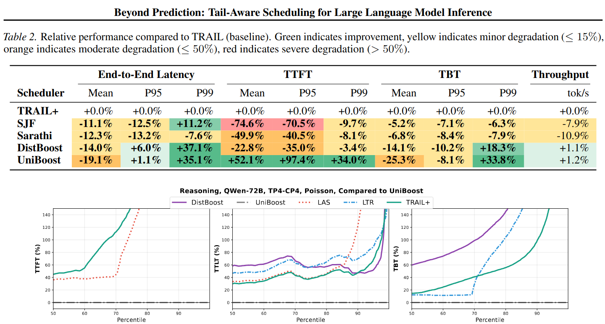

**Beyond Prediction: Tail-Aware Scheduling for LLM Inference| ICML 2026|CCF-A**
- 文章链接：https://icml.cc/virtual/2026/poster/63644
- 代码链接：无，并且文章没有指明推理所用的框架
- 简述：文章借鉴排队理论中的 γBoost（Tail-optimal scheduling）算法，提出了一种面向LLM推理的Boost调度策略。该方法借鉴 $\gamma$ Boost，通过参数 $\gamma$ 调节请求工作量对优先级的影响程度，使调度器能够在 FCFS（优先保障等待时间）和 LAS（优先处理已完成工作量较少的请求）之间动态调整。

# 术语
- TTFT: Time-to-First-Token
- TTLT: Time to Last Token
- TBT : Time between Token
- SJF/SRPT: Shortest job first/Shortest Remaining Processing Time
- SPF: Shortest Prefix First(输入长度短的请求先)
- QPS: Queries Per Second

# 文章认为目前存在的问题和挑战
- 长度预测不可靠：文章指出传统 SJF/SRPT 类 LLM 调度器依赖请求输出长度的预测。但是这个长度即使给定相同的请求和模型，请求的输出长度也是变化的。
- 大部分工作只追求优化平均延迟，而很少考虑优化尾延迟

# 解决思路
文章参考了Strongly tail-optimal scheduling in the light-tailed M/G/1 这篇论文的队列算法。提出了UNIBOOST调度算法。该算法引入参数 $\gamma$ 控制 boost 函数对请求优先级的影响程度，使调度策略可以在 FCFS（公平等待） 和 SJF/LAS（优先处理已完成工作量较少的请求） 之间进行动态调整。当 $\gamma$ 较小时，boost 函数更加关注请求当前工作量，已完成工作量较少的请求获得更高优先级，调度行为更偏向 LAS；当 $\gamma$ 较大时，boost 作用减弱，请求到达时间占主导，调度结果更接近 FCFS，从而避免长请求饥饿。

## UNIBOOST算法操作步骤
大致步骤如下：
- 根据当前请求状态获取工作量信息，并通过MEMGUARD对工作量进行量化，结合 $\gamma$ 参数计算boost值，得到每个请求的优先级并更新队列顺序
- 构建 Batch：从 prefill 和 decode 两个队列中选择优先级最高的请求加入 batch，每次加入前检查该请求执行下一步所需的 KV Cache 空间
- 处理显存不足情况：如果当前 KV Cache 空间不足，则选择优先级较低且正在运行的请求，将其 KV Cache 换出以释放显存
- 执行推理并更新状态：将构建好的batch输入模型执行一次推理，随后更新KV Cache、请求进度以及延迟统计信息，进入下一轮调度

# 实验
文章没有提及使用的框架，使用了8张NVIDIA A100 80GB GPUs。
Qwen-72B推理任务上测试UNIBOOST的尾延迟优化效果，并与以下调度策略进行对比：

- Sarathi（DistBoost）：采用chunk prefill和decode优先的连续批处理策略
- LAS（Least Attained Service）：优先调度已执行工作量较少的请求，类似短任务优先
- LTR：基于输出长度预测的 SJF 类调度方法。
- TRAIL+（SRPT）：假设已知请求输出长度的理想化SRPT策略

实验结果图所示，在高负载场景下（系统利用率 ρ=0.99），UNIBOOST在TTFT、TTLT和TBT三个指标的尾部延迟上均优于其他方法。

