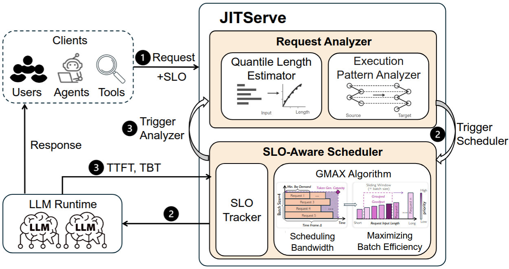

**JITServe: SLO-aware LLM Serving with Imprecise Request Information | NSDI 2026 | A**
- 文章链接：https://arxiv.org/abs/2504.20068
- 代码链接：(基于vLLM改动) https://github.com/UIUC-MLSys/JITServe/
- 简述：JITServe 提出了一种SLO感知的LLM推理调度方法，通过请求分析,GMAX,batch调度和受控抢占，在复杂多类型工作负载下提升服务效率

# 文章工作
- 针对真实的服务场景的研究
- 设计了调度器和GMAX算法，能够估算、优化并利用不精确的请求信息，以最大化goodput
- ITServe在实际工作负载下性能提升明显

# 文章认为目前存在的问题及挑战
文章认为目前LLM serving系统追求优化总体的throughput、平均延迟等，并不能有效提升goodput，相反文章证明了这样可能会降低goodput。 例如一个请求后续还需要调用其他Agent，而该Agent的执行时间长达1分钟。如果调用前的处理耗时5秒且已经满足SLO，即使进一步优化到0.5秒，对整个应用的端到端完成时间提升也非常有限，反而还可能浪费了部分资源。

目前服务系统面临的不确定性和存在的问题:
- 一分钟内请求到达的数量
- 单个请求需要执行的时间
- 请求长度的预测很难
- 只追求整体上的优化
- 只考虑lantcy-senstive(Sarathi-Serve)

文章认为目前请求类型可以大致分为三类：
- Latency sensitive(优先考虑TTFT，TBT) 
- deadline-sensitive(timeto-last-token)
- Compound(Multi-Agent Systems)

# 文章解决思路
文章提出了 JITServe：核心思想是 Just-in-Time scheduling，每个请求分配“刚好满足 SLO 所需”的 serving bandwidth，把剩余 capacity 留给其他请求。框架如下，分为三部分：
- 分析器： 请求和SLO需求到达时，分析器估计出输出长度和执行依赖(Paternal Graph会使用什么tool)
- 调度器： 确定一段时间内每个请求最少需要输出的长度，并将输入长度相等的请求batch在一起
- SLO Tracker： 负责实时观察实际执行情况，动态修正请求完成时间的预测；调度器则依据这些最新预测，决定是否接收新请求以及是否暂停已有请求，以尽量保证所有请求满足 SLO。

## 分析器如何实现
请求输出的预测：
- Quantile Regression Forest(QRF)来预测请求输出的上界。就是通过历史请求的概率分布找到，满足大部分，相似输入长度请求的上界。每次预测只消耗7ms，比BERT快7倍。

Pattern Graph的创建与维护：
- 请求的处理会伴随着一个用户请求会被拆分成多个具有依赖关系的LLM或Tool任务。系统将这些子任务之间执行顺序和关系表示为Pattern Graph，并利用历史Pattern Graph预测新请求的依赖关系和各阶段耗时，从而为不同阶段分配合理的截止时间。图的维护使用K-medoids聚类方法，删除掉不常用的。每个图的大小小于0.2KB。即使有500个图的，匹配的时间也小于5ms。

## 调度器(GMAX)
文章提出Grouped Margin Goodput Maximization 算法。调度器分为两部分，一个分析器，一个产出最优Batch组合。
- 分析器：计算每个请求为了满足SLO，最少需要多少资源。决定好优先级。
- 先根据优先级过滤掉部分的请求，再在高优先级请求将输入长度相近的组为Batch。

若调度器给出的策略不是最优的，会考虑抢占，根据抢占收益与KV Cache迁移成本的比较决定是否抢占，以降低额外开销。

# 实现及实验
文章基于vLLM实现，新增2800行代码。主要是两个模块
- 执行后端：增加policy module，用于扩展调度器，
- Control Plane： 输出长度的预测和Pattern Graph的匹配，放在异步线程中。

## 实验
- 实验设置：使用 Llama-3.1-8B，Qwen2.5-14B，Qwen3-30B-MoE-A3B，Llama-3.1-70B，在 16 张 A100 上测试
- workload包括： chatbot，deep research，agentic code generation，math reasoning
- 对比对象包括： vLLM(FCFS)，Sarathi-Serve(chunked prefills)，Autellix(SJF)，LTR(SJF)
- SLO设置： latency-sensitive(∼2s TTFT and ∼100ms TBT),deadlinesensitive requests(E2EL of 20s), compound(20× (number of stages) seconds)

- 实验效果：JITServe 相比现有方法提升1.4到6.3倍的goodput，或者在相同goodput下节省28.5%到83.2%资源。