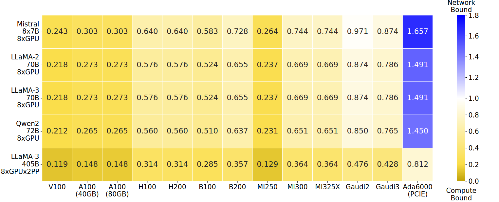
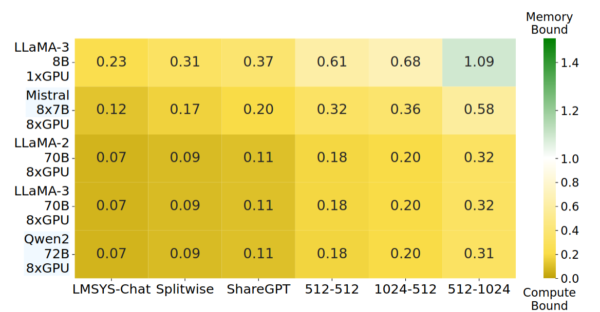
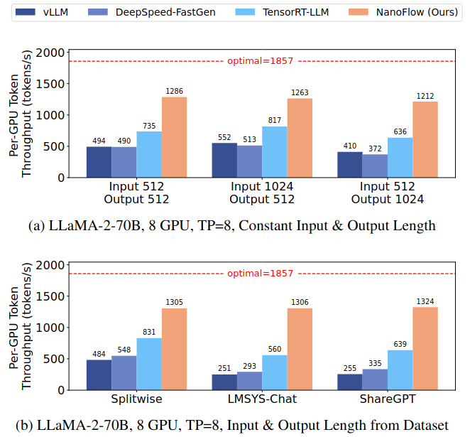

# NanoFlow: Towards Optimal Large Language Model Serving Throughput (`OSDI 2025` [CCF-A])

- 论文链接：https://www.usenix.org/conference/osdi25/presentation/zhu-kan
- 代码：https://github.com/efeslab/Nanoflow
- NanoFlow 是 GPU 设备内部的执行调度系统。它把 batch切成 nano-batches，并自动生成 pipeline，让 compute-bound 的 GEMM，memory-bound 的 decode attention，network-bound 的 TP 通信在同一张 GPU 上重叠执行，从而提升高负载 serving throughput。

---

# 1. 论文要解决什么问题

单个 GPU 内部，一次 iteration 里的不同操作仍然大多按顺序执行，单个操作本身可能对某一种资源利用率高，但其他资源之间没有被同时利用，导致GPU利用率远低。例如

| 操作 | 典型瓶颈 | 问题 |
|---|---|---|
| Dense GEMM | compute-bound | Tensor Core 忙，但 HBM/NVLink 未充分利用 |
| Decode attention / GEMV-like ops | memory-bound | HBM 忙，但 Tensor Core 利用率低 |
| Tensor-parallel communication | network-bound | NVLink/NIC 忙，但 compute 空转 |

# 2. 解决问题的思路和分析实验

## 2.1 解决思路
将输入的 Batch 拆成多个更小的 **nano-batch**，每个 nano-batch 有自己的 **nano-operation**（与原 operation 执行相同计算，只是数据量变小）。由于不同 nano-batch 之间没有数据依赖，原本按顺序执行的操作——计算密集型（GEMM）、内存密集型（decode attention）、通信密集型（AllReduce/AllGather）——可以**同时在 GPU 上并行执行**，从而提高GPU资源的利用率。

这个思路，需要两个前提：
- **前提1**：当内存密集型或通信密集型任务和计算密集型任务并行执行的时候，会互相干扰，需要找到一个资源分配的平衡点。
- **前提1**：能找到一个实际可用的 nano-batch 切分方案（数量、大小、顺序、GPU 资源分配），同时处理好 kernel 间的干扰。

## 2.2 分析实验

**硬件参数**（均为所有 GPU 的聚合值）：

| 参数 | 含义 |
|---|---|
| N_GPU | GPU 数量 |
| MemBW (GB/s) | 总显存带宽 |
| MemSize (GB) | 总显存容量 |
| Compute (GFLOP/s) | 总计算算力 |
| NetBW (GB/s) | 总 GPU 互连带宽（如 NVLink） |

**模型参数**：

| 参数 | 含义 |
|---|---|
| D_model | 隐藏层维度（如 LLaMA2-70B 为 8192） |
| L | Transformer 层数（如 LLaMA2-70B 为 80） |
| P_Model | 模型参数量（如 70B） |
| R_GQA | GQA 分组大小，即共享一个 KV head 的 query head 数量 |
| S_type (Bytes) | 参数数据类型字节数（如 FP16 = 2） |

**Workload 参数**：

| 参数 | 含义 |
|---|---|
| p | 平均 prompt 长度（prefill tokens） |
| d | 平均输出长度（decode tokens） |

文章对上述三种操作数据化，提出了如下的衡量方式：

**内存操作**：如果显存接近满载，可以粗略认为一次 iteration 需要扫描模型权重和 KV cache：

$$T_{mem} \approx \frac{MemSize}{MemBW}$$

**计算操作**：dense GEMM 主导计算量，一个 token 经过所有层大约需要 $2 \times P_{Model}$ FLOPs：

$$T_{compute} \approx \frac{2 \cdot B_{dense} \cdot P_{Model}}{Compute}$$

其中 $B_{dense}$ 是 dense GEMM 看到的 token batch size，包含 prefill tokens 和 decode tokens。

**通信操作**：TP 下每层需要 collective communication，通信量与 batch token 数、hidden size、层数相关：

$$T_{net} \approx \frac{4 \cdot N_{GPU} \cdot B_{dense} \cdot D_{model} \cdot S_{type} \cdot L}{NetBW}$$

论文用这些公式比较 $T_{compute}$、$T_{mem}$ 和 $T_{net}$。

这个是通信时间和计算时间比较：

上图是 $T_{net}/T_{compute}$ 的热力图，横轴为不同显卡，纵轴为不同模型。越接近黄色越 compute-bound，越接近蓝色越 network-bound。**几乎所有组合都是黄色——通信不是瓶颈。**

这个是存储时间和计算时间比较：

上图是 $T_R$ 热力图。越接近黄色越 compute-bound，越接近绿色越 memory-bound。**除了 LLaMA-3-8B + 长 decode（512-1024 tokens）的组合 $T_R \approx 1$ 外，其余全部为 compute-bound。** 尤其在 70B 级别模型上，$T_R$ 远小于 1（compute/memory 比值 > 2）。

最后得到：在batch很大、高速互连的情况下，compute 往往是主导项。这样就可以让 memory/network 操作尽量在计算密集型的执行窗口里跑起来。

---

# 3. NanoFlow 的核心设计
NanoFlow 核心分为两部分：自动搜索引擎（生成 pipeline）和 异步执行pipeline 。

## 自动搜索引擎
它首先通过分析获取不同 kernel 在独立执行和并行执行时的性能与资源干扰特性；随后，在 Stage I 中利用 MILP(mixed integer linear programming)找到 nano-operations 的切分方式、批大小、执行顺序以及 overlap 关系，以尽可能消除 pipeline bubble；最后，在 Stage II 中结合 之前资源的分析，对资源分配和执行时间进行修正，生成一条低干扰、高overlap的执行 pipeline。

## 运行时
NanoFlow 会尽量维持稳定的 dense batch size：
- decode 请求优先进入 batch；
- prefill 被切成 token chunks 填充剩余 dense batch 空间；
- CPU 侧 batch formation 与 GPU 执行异步重叠，减少调度开销暴露在 critical path 上。

# 4. 实验结果
论文在 LLaMA-2-70B，LLaMA-3-70B，LLaMA-3-8B，Qwen2-72B，DeepSeek-67B，Mixtral 8x7B 等模型上评估 NanoFlow。
主要结论是：

- 相比现有 serving 系统，NanoFlow 最高提供约 **1.91x** throughput 提升；
- 在不同模型上达到理论最优吞吐的 **59% 到 72%**；
- 在 LLaMA-2-70B on 8xA100 的设置下，NanoFlow 达到最优吞吐的比例明显高于 vLLM(2024年7月23日)、DeepSpeed-FastGen 和 TensorRT-LLM。

# 5. 和业界系统的关系
目前没有看到 vLLM 或 TensorRT-LLM 公开采用 NanoFlow 完整方案。