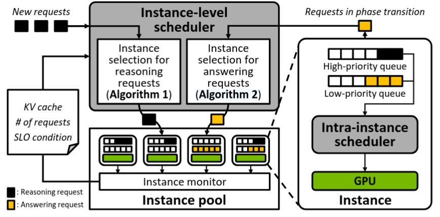
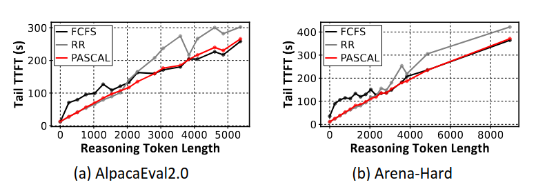

**PASCAL: A Phase-Aware Scheduling Algorithm for Serving Reasoning-based Large Language Model | HPCA 2026 | A**
- 文章链接：https://arxiv.org/abs/2602.11530
- 代码链接：代码未开源
- 简述：Reasoning-based模型推理Decode阶段分为Reasoning和Answering，文章优先处理Reasoning阶段的请求，提升这部分的TTFT。

# 存在的问题
传统 LLM 推理通常分为 prefill 和 decode 两个阶段，其中 prefill 阶段的延迟主要由 TTFT 衡量，而 decode 阶段的生成速度主要由 TPOT 衡量。对于 reasoning-based LLM，这种阶段与指标的对应关系不再适用。由于模型在输出最终答案前会先生成大量不可见的 reasoning tokens，原本的 decode 阶段进一步被划分为 reasoning phase 和 answering phase。因此，reasoning-based LLM 的推理过程可以看作三个阶段：prefill、reasoning 和 answering。由于 reasoning tokens 对用户不可见，但其生成时间会延迟第一个用户可见 answer token 的产生，因此 reasoning phase 的延迟会直接影响 TTFT，应该被重点优化。而 answering phase 则主要关注 TPOT 是否满足用户体验要求。

# 解决思路
文章认为调度器应区分reasoning(TTFT)和answering(TPOT)。文章选择DeepSeek-R1Distill-Qwen-32B模型，可以直接在H100 GPU上运行。这里使用多个GPU，运行了多个模型的实例。
调度器设计如下：

调度策略系统分为两部分：

1. Instance-level scheduling： 决定请求在哪个GPU上执行，以及 phase变化时是否迁移请求。对于 reasoning 请求，调度器优先选择满足KV cache 占用较小的GPU。对于进入 answering 阶段的请求，调度器选择 reasoning 请求较少的GPU。
2. Intra-instance scheduling： 决定单个 GPU instance 内请求的执行顺序和batch。Reasoning 请求进入高优先级队列，优先分配 GPU 资源。Answering 请求进入低优先级队列，利用剩余资源执行。当请求phase发生了变化，调度器重新选择GPU，并根据目标GPU和当前GPU的显存情况决定是否迁移。

为什么要迁移：作者通过关闭迁移实验发现，即使 reasoning 调度正常，如果请求固定在原GPU，reasoning 完成后的 answering 请求仍可能因为显存竞争而阻塞。

# 实验 
实验采用 DeepSeek-R1-Distill-Qwen-32B，在 8 个 H100 GPU上进行测试，每个GPU上运行一个模型实例。使用 AlpacaEval2.0 和 Arena-Hard 数据集，并与 FCFS、RR 两种调度策略比较。实验表明，PASCAL 能降低 reasoning-based LLM 的 tail TTFT，但是一旦Reasoning阶段输出长度过长，效果和FCFS差不多。

