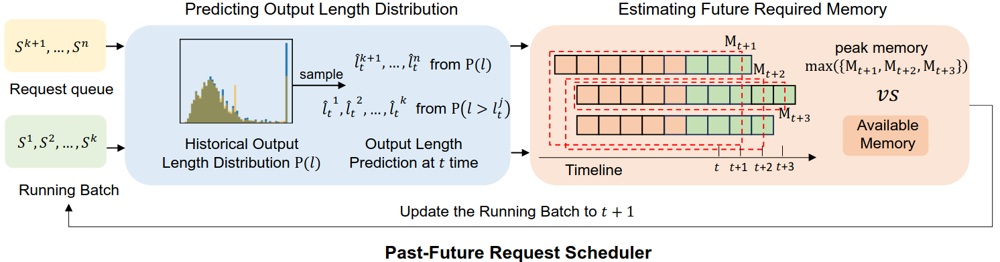
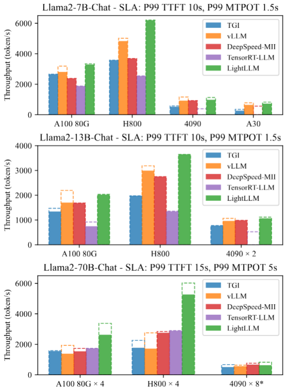

**Past-Future Scheduler for LLM Serving under SLA Guarantees| ASPLOS 2025 | CCF-A**

  - 文章链接：https://dl.acm.org/doi/10.1145/3676641.3716011
  - 代码链接：https://github.com/ModelTC/lightllm
  - 简述：预测请求输出的长度，再计算未来的内存占用情况，动态决定新的请求啥时加入运行的batch

# 文章的贡献
- 1. 请求输出长度的预测
- 2. 未来内存使用情况的预测
- 3. 设计了LightLLM
- 4. 在多个硬件平台做了全面的实验来验证

# 目前主流调度器的不足：
SLA由三个指标衡量： Time To First Token (TTFT), Time Per Output Token (TPOT), and Max Time Per Output Token (MTPOT)

LLM serving 中，调度器需要同时满足SLA和提高吞吐，但新请求输出长度和未来KV cache占用在到达时未知。文章认为目前调度器走两个极端：

  - 1. 保守调度：按最大输出长度估计未来KV内存占用，可以减少eviction/SLA violation，但会导致batch size偏小、吞吐降低。
  - 2. 激进调度：按较短输出长度估计KV占用，可以提高吞吐。一旦内存不足就会导致eviction，进而违反SLA。

为什么会走两种极端：
  - 1. 计算正在运行的batch的未来内存需求很难
  - 2. 估计请求输出长度的同时保证低开销很难

# 文章如何解决
文章提出了 Past-Future Scheduler：调度器利用历史请求的输出长度分布，动态预测当前 running requests 未来还会生成多少token，并据此估计未来 KV cache 峰值。在调度 waiting队列的请求时，它会先预测候选请求的输出长度，再模拟该请求加入 running batch 后的未来 KV cache 占用情况，只有当未来峰值显存仍满足约束时，才允许该请求进入 batch。这样可以在避免 eviction 的同时，比保守策略接纳更多请求。

## 如何预测输出请求的长度
文章认为现存的预测方法不仅会产生额外的开销而且不具有实用性，但是没有提及现有方法有哪些。文章解决思路在每一个iteration：
- 1. 根据历史请求输出长度的分布，来预测当前请求队列(等待被服务)中所有请求输出长度
- 2. 根据正在运行的请求队列中已经生成的长度，更新预测长度

为什么这样预测可行，文章用多个数据集做了实验：
- 1. 以1000个请求为一个windows，切分数据集，使用向量的余弦相似性验证。上下window的请求输出长度的分布，具有较大的相似性
- 2. 改变window的大小，上下window的请求输出长度的分布依旧具有较大的相似性

## 内存如何估计
未来需求内存估计：
- 1. 根据预测的输出长度，算出每个请求剩余的长度。再根据这个长度，计算每个请求完成之前的内存占用情况，取最大的内存占用值作为指标。
- 2. 在新请求加入前，计算请求加入后内存是否超出指标，再选择是否加入

# 实现方式及实验
文章设计了一个新框架LightLLM，调度器使用并行计算执行，开销仅占模型推理的百分之一。

## 实验
- 实验设置：实验使用 Llama2 系列模型，对比对象包括：
  - Text-Generation-Inference，保守调度
  - vLLM，激进调度
  - DeepSpeed-MII/FastGen，保守调度

实柱为goodput，虚线为throughput。 Past-Future Scheduler 的重点不是追求最高throughput，而是在 SLA 约束下提高有效吞吐。实验结果显示，它在多数负载下能取得更高goodput，同时避免激进调度中因KV cache不足导致的eviction 和SLA violation